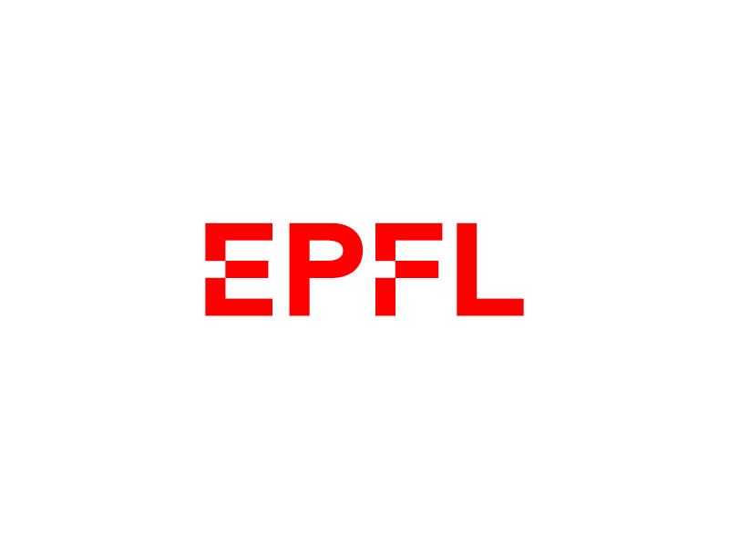

# Welcome to the universe of my lecture notes

My lecture/textbook notes that I am using for my Computer Science study at EPFL. I try to update them weekly and you should find a compiled pdf under each section. For your convience I have added the direct links below:

1. [ SemesterOne-2019](#sm1)

## SemesterOne-2019
> Linear Algebra: [Latest linear algebra notes](https://github.com/alptheexplorer/epflLectureNotes/blob/master/epflLectureNotes/linearAlgebra/linearAlgebra.pdf)

> Advanced information and computation: [Latest aicc notes](https://github.com/alptheexplorer/epflLectureNotes/blob/master/epflLectureNotes/advancedComputation/aicc.pdf)

> Analysis 1:  [Latest analysis notes](https://github.com/alptheexplorer/epflLectureNotes/blob/master/epflLectureNotes/analysis/analysis.pdf)

> Programming in Java:  [Latest programming notes](https://github.com/alptheexplorer/epflLectureNotes/blob/master/epflLectureNotes/IntroductionToProgramming-Sam/ch1.md)

*Physics course has been omitted*

**Please note that I am a broke college student who likes spending money on gymshark shirts, perhaps you could help me fullfill my childhood dreams of unlimited gymshark shirt :)**

