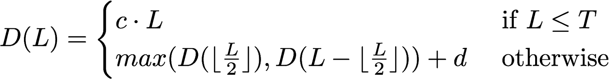

# Exercise 1 : Aggregate

In this week's lecture, you have been introduced to the aggregate method of `ParSeq[A]` (and other parallel data structures...). It has the following signature:

```scala
def aggregate[B](z: B)(f: (B, A) => B, g: (B, B) => B): B
```

Discuss, as a group, what aggregate does and what its arguments represent.

## Question 1

Consider the parallel sequence `xs` containing the three elements `x1`, `x2` and `x3`. Also consider the following call to aggregate:

```scala
xs.aggregate(z)(f, g)
```

The above call might potentially result in the following computation:

```scala
f(f(f(z, x1), x2), x3)
```

But it might also result in other computations. Come up with at least 2 other computations that may result from the above call to `aggregate`.

## Question 2

Below are other examples of calls to aggregate. In each case, check if the call can lead to different results depending on the strategy used by `aggregate` to aggregate all values contained in `data` down to a single value. You should assume that `data` is a parallel sequence of values of type `BigInt`.

Variant 1

```scala
data.aggregate(1)(_ + _, _ + _)
```

Variant 2

```scala
data.aggregate(0)((acc, x) => x - acc, _ + _)
```

Variant 3

```scala
data.aggregate(0)((acc, x) => acc - x, _ + _)
```

Variant 4

```scala
data.aggregate(1)((acc, x) => x * x * acc, _ * _)
```

## Question 3

Under which condition(s) on `z`, `f`, and `g` does aggregate always lead to the same result?
Come up with a formula on `z`, `f`, and `g` that implies the correctness of aggregate.

*Hint*: You may find it useful to use calls to `foldLeft(z)(f)` in your formula(s).

## Question 4

Implement `aggregate` using the methods `map` and/or `reduce` of the collection you are defining aggregate for.

## Question 5

Implement `aggregate` using the `task` and/or `parallel` constructs seen in the first week and the `Splitter[A]` interface seen in this week's lecture. The `Splitter` interface is defined as:

```scala
trait Splitter[A] extends Iterator[A] {
  def split: Seq[Splitter[A]]
  def remaining: Int
}
```

You can assume that the data structure you are defining aggregate for already implements a `splitter` method which returns an object of type `Splitter[A]`.

Your implementation of `aggregate` should work in parallel when the number of remaining elements is above the constant THRESHOLD and sequentially below it.

*Hint*: `Iterator`, and thus `Splitter`, implements the `foldLeft` method.

## Question 6

Discuss the implementations from questions 4 and 5. Which one do you think would be more efficient?

# Exercise 2 : Depth

Review the notion of depth seen in the lecture. What does it represent?

Below is a formula for the depth of a *divide and conquer* algorithm working on an array segment of *size L*, as a function of *L*. The values *c*, *d* and *T* are constants. We assume that *L>0* and *T>0*.



Below the threshold *T*, the algorithm proceeds sequentially and takes time *c* to process each single element. Above the threshold, the algorithm is applied recursively over the two halves of the array. The results are then merged using an operation that takes *d* units of time.

## Question 1

Is it the case that for all *1 ≤ L1 ≤ L2* we have *D(L1) ≤ D(L2)*?

If it is the case, prove the property by induction on *L*. If it is not the case, give a counterexample showing values of *L1*, *L2*, *T*, *c*, and *d* for which the property does not hold.

## Question 2

Prove a logarithmic upper bound on *D(L)*. That is, prove that *D(L)* is in *O(log(L))* by finding specific constants *a*, *b* such that *D(L) ≤ a &ast; log2(L) + b*.

*Hint:* The proof is more complex that it might seem. One way to make it more manageable is to define and use a function *D'(L)* that has the property described in question 1, and is greater or equal to *D(L)*. We suggest you use:


Also remark that computing *D'(L)* when *L* is a power of 2 is easy. Also remember that there always exists a power of 2 between any positive integer and its double.
