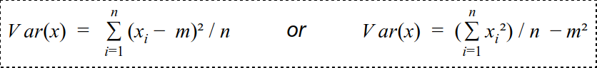

# Exercise 1 : Federal Statistical Office

You have been recently hired as a Spark consultant at the Federal Statistical Office in Neuchâtel. They have recently started using Spark for all their data processing tasks, but for some reason, they are not entirely satisfied with Spark thus far.

Below is the datatype they use to record information about people living in Switzerland. The RDD that contains all records (several millions) is called people.

```scala
case class Person(age: Long, salary: Long, town: Int)
val people: RDD[Person] = ???
```

The Spark cluster they have put in place consists of 8 identical machines, each of which has 4 cores.

## Question 1.1

On your very first day, you are immediately tasked with investigating some piece of code. Even though the statistician that wrote the code is absolutely sure it is correct, he is not satisfied with its performance! It's awfully slow!

```scala
people.groupBy(_.age).map {
  case (age, peopleOfAge) =>
    val salaries = peopleOfAge.map(_.salary)
    val n = peopleOfAge.size
    val mean = salaries.sum / n
    val variance = salaries.map(x => (x - mean) * (x - mean)).sum / n

    (age, (mean, Math.sqrt(variance).toLong))
}
```

Using your own words, explain why the above code is supposed to do and why it is not as efficient as it could be. What happens?

*Hint*: You may find it useful to draw a graphical representation of the nodes and show data exchanges between the nodes.

## Question 1.2

Rewrite the above piece of code to be as efficient as possible. In your solution, try to keep the communication overhead between the nodes as small as possible. Think about the location of your data on the different nodes.

*Hint*: You may recall from your Probabilities and statistics course that there exist multiple formulas to compute the variance of a series x of n values with mean m. For instance:



One of the two forms might be more appropriate in your solution.

## Question 1.3

Could the computation be done even faster if the data was already partitioned? Write the code to partition the data, using a `Partitioner`, to improve data locality.

# Exercise 2 : Partitioners

## Question 2.1

What is a partitioner? Come up with *two reasons* why you would want to repartition data.

## Question 2.2

Which of the following transformations preserve the partitioner of the parent RDD, if any?

- `map`
- `mapValues`
- `filter`
- `flatMap`
- `flatMapValues`
- `join`
- `reduceByKey`
- `groupByKey`

Within your group, discuss what makes it possible for some transformations to preserve and propagate the parent's partitioner.

## Question 2.3

Which of the following transformations will return an RDD with a partitioner, even when the parent doesn't have one?

- `map`
- `mapValues`
- `filter`
- `flatMap`
- `flatMapValues`
- `join`
- `reduceByKey`
- `groupByKey`

## Question 2.4

What is the difference between a `HashPartitioner` and a `RangePartitioner`? When would you use one over the other?
