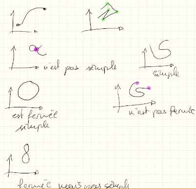
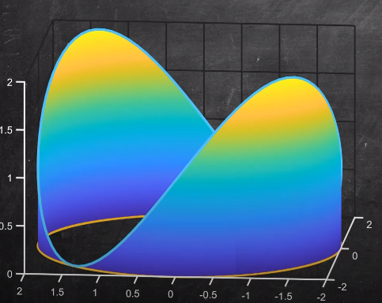
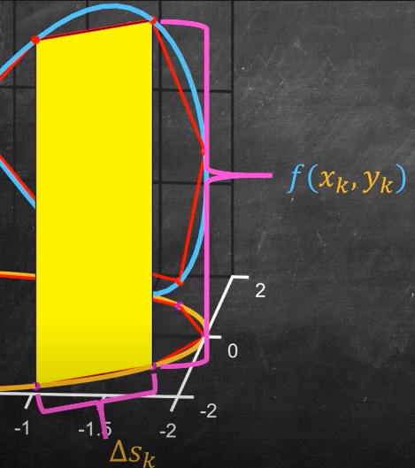
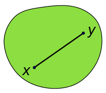
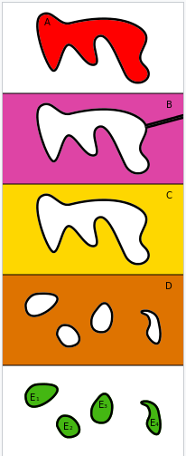
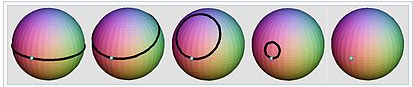

<!-- vscode-markdown-toc -->
* 1. [Week 1: Differential operators](#Week1:Differentialoperators)
* 2. [Week 2/3: Line integrals, Greens theorem](#Week23:LineintegralsGreenstheorem)

<!-- vscode-markdown-toc-config
	numbering=true
	autoSave=true
	/vscode-markdown-toc-config -->
<!-- /vscode-markdown-toc --># Analysis 3 

##  1. Week 1: Differential operators 

**Gradient**: For $\Omega$ open, $f: \Omega \to \mathbb{R}$ is defined as: 

$$\nabla f(x) = (\frac{\partial f}{\partial x_{1}}, ...)$$

**Divergence**: For $\Omega$ open, $F: \Omega \to \mathbb{R}^{n}$ is defined as: 

$$div F(x) = (\nabla \cdot F)(x) = \frac{ \partial F_{1}}{\partial x_{1}} + ... \ + \frac{ \partial F_{n}}{\partial x_{n}} $$ 

**Rotational(better known as curl)**: Let $F: \Omega \to \mathbb{R}^{n}$ 

if $n=2$ then: 

$$rot F(x,y) = \frac{\partial F_{2}}{\partial x} - \frac{\partial F_{1}}{\partial y}$$

if $n=3$ then: 

$$rot F(x,y) = (\frac{\partial F_{3}}{\partial y} - \frac{\partial F_{2}}{\partial z}, \frac{\partial F_{1}}{\partial z} - \frac{\partial F_{3}}{\partial x}, \frac{\partial F_{2}}{\partial x} - \frac{\partial F_{1}}{\partial y} )$$

The best way to remember the formula for the case $n=3$ is by using the determinant formula for the following matrix:

$$\begin{bmatrix} e_{1} \ e_{2} \ e_{3} \\ \frac{\partial}{\partial x} \ \frac{\partial}{\partial y} \ \frac{\partial}{\partial z} \\ F_{1} \ F_{2} \ F_{3} \end{bmatrix}$$

**Laplacian**: Let $F: \Omega \to \mathbb{R}$, then:

$$ lap(f) = \Delta f = div(grad(f)) = \frac{\partial F_{1}^{2}}{\partial{x_{1}}^{2}} + ... \ +  \frac{\partial F_{n}^{2}}{\partial{x_{n}}^{2}}$$

If $\Delta f = 0$ then $f$ is harmonic. 

**Important result**: Let $\Omega \subset \mathbb{R}^{n}$ and $f$ a scalar map with $f \in C^2$ and $F: \Omega \to \mathbb{R}^{n}$ with $F \in C^2$ then: 

1. $div \ grad f = \Delta f$
2. for $n=2$, $rot \ grad f = 0$
3. for $n=3$, $rot \ grad f = \vec0$

**Some more intuition**

##  2. Week 2/3: Line integrals, Greens theorem 

$R \subset \mathbb{R}^{n}$ is a simple regular curve if there exists an interval $[a,b] \subset \mathbb{R}$ and a function $f: [a,b] \to \mathbb{R}^{n}$ such that:

1. $R = f([a,b])$
2. $r$ is injective on $[a,b[$
3. $r \in C^{1}$
4. $||r^{\prime}(t)|| \not = 0$

If the first two properties hold, the curve is said to be *simple*. If the two start and endpoints meet, the curve is said to be *closed*. If all the above hold, then the curve is said to be a *regular* curve. A *regular* curve is one where the velocity is never zero. 

Some visuals below: 

**Line integral over a scalar field** 
Let $r: [a,b] \to \mathbb{R}^{n}$ and $f:R \to \mathbb{R}$. Then the integral of $f$ along $R$ is defined as: 

$$\int f = \int_{a}^{b} f(r(t))||r^{\prime}(t)||dt$$

Here is some intuition for the line integral: 

The best way to see a line integral is thus to realize that it is merely the area encapsulated by some curve which is a function of $t$ with the height given by some other function $f$. 

We find the length of a curve as:

$$long L = \int 1 dl$$ that is we let the height function be 1. 

**Potential field**
$F$ is said to be derived from a potential if there exists $f$ such that $F = \nabla f$. Then we also have that $rot F = 0$ that is:

$$\frac{\partial F_{i}}{\partial x_{j}} - \frac{\partial F_{j}}{\partial x_{i}} = 0$$

But the above condition doesn't guarantee the existance of a potential $f$. We must have that the domain of $f$ which is $\Omega$ must be convex or a simply connected domain. 

**Convex sets**
A set $\Omega \in \mathbb{R}^n$ is convex if $\forall A \in \Omega$ and $\forall B \in \Omega$, a straight line joining $A$ and $B$ is also in $\Omega$.  

**Connected set**
A set $\Omega \in \mathbb{R}^n$ is connected if the set cannot be represented as the union of two or more disjoint non-empty open subsets. 

All the above sets except for the one in green are connected. The last one is clearly not connected because there is no way of us representing it as the union of two or more disjoint non empty open subsets since we would not get the entire set. 

**Simply connected sets**
We provide a rather informal definition for a simply connected set. A set is said to be simply connected if any simple closed curve can continuously be shrunk to a point. 

So for instance a sphere would be a simply connected space whereas the blue segment in $\mathbb{R}^2$ would not be simply connected but in $\mathbb{R}^3$ it would be simply connected. 

**Simply connected sets in $\mathbb{R}^2$**
A simply connected set in $\mathbb{R}^2$ is one that does not have any holes. 

**Neccesary condition** 
The neccesary condition for the potential field theorem to hold is that the domain set $\Omega$ is connected, and the optional condition is that it is simply connected. 

We also have the following: 
$$\Omega \ \text{is not connected} \implies \Omega \ \text{is not simply connected} \implies \Omega \ \text{is not convex}$$

**Important equivalence**
The following two statements are equivalent: 

1. $F$ derives from a potential on $\Omega$
2. $\forall A,B \in \Omega$ and curves $R_{1}, R_{2} \in \Omega$ joining $A,B$ we have $\int_{R_{1}}Fdl = \int_{R_{2}}Fdl$ 
3. $\int_{R} Fdl = 0$ for all simple regular closed curves in $\Omega$. 

**Determining if $F$ derives from a potential**

These are the steps we will follow:

1. Verify that $rot F = 0$ if yes then move to step 2
2. Verify that $\Omega$ is convex if yes then we are done, otherwise step 3
3. (most problems in exam take us to this step) Integrate $f(x,y,z) = \int F_{1}(t,y,z)dt + \alpha(y,z)$ and try to ajust $\alpha$ such that $\nabla f = F$ and goal is to find some $f$ which is the antiderivative of $F$. If we can't find such an $f$, our goal is to find some curve $l$ along which $\int Fdl \not = 0$ which naturally implies that $F$ can not be a potential. *Note that stating that because we can't find such a curve l with $\int Fdl \not = 0$ is never a valid reason to state F derives a potential*

## Week 4: Green's theorem 

**Boundary**
Recall the boundary of some set $S$ is $\partial S = \{x \in \mathbb{R}^{n} | \forall \epsilon > 0 \ B_{\epsilon}(x) \cap S \not = 0 \land B_{\epsilon}(x) \cap S^{c} \not = 0\}$

 **Green's theorem**
 $$\int_{C} F \cdot dr = \int_{C} Pdx + Qdy = \int \int_{D}(\frac{\partial Q}{\partial x} - \frac{\partial P}{\partial y})dxdy$$ in terms of the curl we would say:

 $$\int \int _{D} rot F(x,y)dxdy = \int F \cdot dl $$

 **Corollary to Green**
 Let $\Omega$ be a simple regular curve. Let $F = (-y,x)$ and $G_{1} = (0,x)$ and $G_{2} = (-y,0)$ then: 
 $$\text{area}(\Omega) = \frac{1}{2}\int_{\partial \Omega} F \cdot dl = \int_{\partial \Omega} G_{1} \cdot dl = \int_{\partial \Omega} G_{1} \cdot dl$$

**Exterior normal**
For some simple regular curve $\Omega$, $v_{x_{0}}$ is a normal unit exterior if:
1. $|v_{x_{0}}| = 1$
2. for some parametrisation $\lambda$ of $\Omega$ with $\lambda(t_{0}|t_{0} \in [a,b])$ we have $<\lambda^{\prime}(t_{0}), v_{x_{0}}> = 0$
3. $\exists \epsilon_{0} $ such that $\forall 0 < \epsilon < \epsilon_{0}$, $x_{0} + \epsilon v_{x_{0}} \not \in \Omega$

**Theorem**
let $\lambda: [a,b] \to \mathbb{R}^{2}$ be a parametrisation of the boundary of $\Omega$ leaving the domain on the right. Then:

$$v_{\lambda} = \frac{1}{|\lambda^{\prime}|(\lambda_{2}^{\prime},- \lambda_{1}^{\prime})}$$

