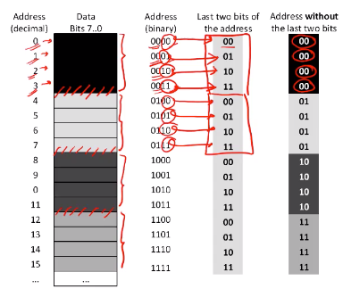

# Computer Architecture 

## Week 1: Simple general processor

### Datapath 
The datapath consists of components capable of performing *arithmetic/logic* operations as well as components that *hold data*. 


Let's take a simple example, the ALU(*Arithmetic Logic Unit*) will take an input operand from the register file(quite similar to how a MUX receives an input). The result is then written to the register file. 


## Lab 1: VHDL testbenching 
**link for school hosted vm: https://support.epfl.ch/epfl?id=epfl_kb_article_view&sys_kb_id=eff9d6aedb4b978cef64731b8c9619b3** 

The goal of this adder is to test a combinational and a sequential adder. Our template folder structure is as follows:

```
--main
  --modelsim
  --testbench
    ---tb_adder_combinatorial.vhd
    ---tb_adder_sequential.vhd
  --vhdl 
    ---adder_combinatorial.vhd
    ---adder_sequential.vhd
```

Our testbench files will not compile since they are empty. So we fill them up in the rawest form possible 

```vhdl 
library ieee;
use ieee.std_logic_1164.all;
use ieee.numeric_std.all;
entity tb_adder_combinatorial is
end tb_adder_combinatorial;
architecture test of tb_adder_combinatorial is
begin
end architecture test;
```

We must now instantiate the DUT(Design under test) as follows:

```vhdl 
library ieee;
use ieee.std_logic_1164.all;
use ieee.numeric_std.all;
entity tb_adder_combinatorial is
end tb_adder_combinatorial;
architecture test of tb_adder_combinatorial is
-- adder_combinatorial GENERICS
constant N_BITS : positive range 2 to positive'right := 4;
-- adder_combinatorial PORTS
signal OP1 : std_logic_vector(N_BITS - 1 downto 0);
signal OP2 : std_logic_vector(N_BITS - 1 downto 0);
signal SUM : std_logic_vector(N_BITS downto 0);
begin
dut : entity work.adder_combinatorial
generic map(N_BITS => N_BITS)
port map(OP1 => OP1,
OP2 => OP2,
SUM => SUM);
end architecture test;
```
We must now feed inputs to the DUT as:
Supply OP1 and OP2 then verify SUM

The best way to realize this is a process inside our testbench architecture. Since we want to delay our inputs, we also declare a TIME_DELTA constant that will change the value of OP1 an OP2. We achieve the delay through the **wait for** statement. 

```vhdl 
library ieee;
use ieee.std_logic_1164.all;
use ieee.numeric_std.all;
entity tb_adder_combinatorial is
end tb_adder_combinatorial;
architecture test of tb_adder_combinatorial is
-- "Time" that will elapse between test vectors we submit to the component.
constant TIME_DELTA : time := 100 ns;
-- adder_combinatorial GENERICS
constant N_BITS : positive range 2 to positive'right := 4;
-- adder_combinatorial PORTS

signal OP1 : std_logic_vector(N_BITS - 1 downto 0);
signal OP2 : std_logic_vector(N_BITS - 1 downto 0);
signal SUM : std_logic_vector(N_BITS downto 0);
begin
-- Instantiate DUT
dut : entity work.adder_combinatorial
generic map(N_BITS => N_BITS)
port map(OP1 => OP1,
OP2 => OP2,
SUM => SUM);
-- Test adder_combinatorial
simulation : process
begin
-- Assign values to circuit inputs.
OP1 <= "0001"; -- 1
OP2 <= "0101"; -- 5
-- OP1 and OP2 are NOT yet assigned. We have to wait for some time
-- for the simulator to "propagate" their values. Any infinitesimal
-- period would work here since we are testing a combinatorial
-- circuit.
wait for TIME_DELTA;
-- Assign values to circuit inputs.
OP1 <= "0011"; -- 3
OP2 <= "0010"; -- 2
-- OP1 and OP2 are NOT yet assigned. We have to wait for some time
-- for the simulator to "propagate" their values. Any infinitesimal
-- period would work here since we are testing a combinatorial
-- circuit.
wait for TIME_DELTA;
end process simulation;
end architecture test;
```

We may want the simulation to run on modelSim for as long as needed. To do this, we insert the `run -all` command and add an indefinite `wait` statement to the end of our process. 

Also notice how the a change in value of the above signals leads to code duplication. To avoid this, we use a **procedure**. The refactored code now looks like:


```vhdl 
library ieee;
use ieee.std_logic_1164.all;
use ieee.numeric_std.all;
entity tb_adder_combinatorial is
end tb_adder_combinatorial;
architecture test of tb_adder_combinatorial is
-- "Time" that will elapse between test vectors we submit to the component.
constant TIME_DELTA : time := 100 ns;
-- adder_combinatorial GENERICS
constant N_BITS : positive range 2 to positive'right := 4;
-- adder_combinatorial PORTS
signal OP1 : std_logic_vector(N_BITS - 1 downto 0);
signal OP2 : std_logic_vector(N_BITS - 1 downto 0);
signal SUM : std_logic_vector(N_BITS downto 0);
begin
-- Instantiate DUT
dut : entity work.adder_combinatorial
generic map(N_BITS => N_BITS)
port map(OP1 => OP1,
OP2 => OP2,
SUM => SUM);
-- Test adder_combinatorial
simulation : process
procedure check_add(constant in1 : in natural;
constant in2 : in natural) is
begin
-- Assign values to circuit inputs.
OP1 <= std_logic_vector(to_unsigned(in1, OP1'length));
OP2 <= std_logic_vector(to_unsigned(in2, OP2'length));
-- OP1 and OP2 are NOT yet assigned. We have to wait for some time
-- for the simulator to "propagate" their values. Any infinitesimal
-- period would work here since we are testing a combinatorial
-- circuit.
wait for TIME_DELTA;
end procedure check_add;
begin
-- Check test vectors
check_add(12, 8);
check_add(10, 6);
check_add(4, 1);
check_add(11, 7);
check_add(10, 13);
check_add(8, 7);
check_add(1, 9);
check_add(7, 3);
check_add(1, 4);
check_add(8, 0);
-- Make this process wait indefinitely (it will never re-execute from
-- its beginning again).
wait;
end process simulation;
end architecture test;
```


# Week 2: Memory and ISA(Instruction Set Architecture)

## Architecture of the memory

The best way to visualize memory is to see it as a 2D array of stored bits. Each row of bits corresponds to an *adress* and each *adress* stores a word. The 3 essential units we use to create a memory are:

- binary decoder
- MUX
- memory cells


As we can see below, N bits are sent into to the binary decoder to select the address. 


However things aren't that simple. What really is the best way to organize our array of cells. Do we maximize the amount of adresses or word capacity? Well given that we will be transmitting signals to each row and column, and given that both of these signals have some sort of delay due to physics, we need the most optimal design. Let's model this delay(linear) as:

x = k*#Columns

y = k*#Rows

Thus the total delay which is x+y = k(#Rows + #Columns). The way to minimize this delay is to find the least sum given that the product of Columns and Rows is constant. It turns out that this is minimal when Rows=Columns, hence why our 2D array is as close to a square as possible. 


Now given this design, it is smarter to have one adjacent adresses. In fact this is the only way we can achieve that square design.


A smart observation shows that using the least significant bit of the binary decoder output, we can already decide if we are looking at the left or right column for even adresses are all have 0 in their LSB. We then use the remaining 3 bits which ranges from 0 to 7 to decide on the row. Hence the complete architecture will look as:


## Inside the memory cell

Each memory cell is essentially a transistor. It is the different arrangement of transistors that lead to different memory types such as *SRAM* and *DRAM*. 

**SRAM**

- content will last as long as power is on
- basic cell is similar to flip flop 
- high power consumption and expensive build
- used in register files, buffer, cache 

**DRAM**

- needs regular refresh to prevent data loss
- basic cell is a capacitor and switch 
- low power consumption, cheap build, slow 

Here is the typical SRAM interface: 


A typical SRAM read cycle is as follows:

1. Put valid adress on adress bus
2. Select given memory chip which means CS goes to 0 once adress has been selected
3. Wait for data to appear 
4. Deselect the memory which means CS becomes 1 again 


Similarly, a write cycle looks like:


## Week 3: MIPS ISA(Instruction set architecture)

The 5 components of an ISA are:

- Instruction classes
- Registers
- Memory
- Instruction encoding
- Addressing modes 

### Instruction classes

The available instruction classes in MIPS are:

- operations on data
- data transfer
- control flow instructions
- pseudo instructions 

**Data operation** class:


As we see, the instructions all start with a *pneumonic* to aid us in understanding the purpose of the function. 

**Data transfer** class:


**Control flow** class:


**Pseudo instructions** class:


### MIPS registers

Most machines nowadays use general purpose registers. Registers are *faster* than memory  which results in faster program execution and they *improve code density* because they are named with fewer bits than addresses(that is encoding each register name is shorther than encoding memory locations).

MIPS register file contains 32 registers, numbered from $0 to $31 with certain registers having special functionality ie $0 is hardwired to zero and $31 used for function return address. All registers are 32-bit wide. 

​				 

Any real program will have more variables than there are registers. Registers thus get reused or variables must get spilled to memory which is taken care of by the compiler. 

*Some examples*

``` assembly
# store 77 at t1
addi $t1, $zero, 77
```

The reason we add zero is that there is no command to directly store 77, hence we must use addition by zero.

``` assembly
add $t3, $t1, $t2 #t1-t2
sub $t3, $t1, $t2 #t2-t1
```

Some bitwise operations

``` assembly
and $t4, $t1, $t2 # 0100 1101 & 0011 0111 = 0000 0101
```

### MIPS memory organization

Memory is organized in bytes with 32 bit long adresses. Now one address corresponds to one byte. The memory instructions are `lb` to load one byte and `sb` to store one byte to memory. 

In modern architectures, more than one address can be loaded, it is common to load words which corresponds to 4 bytes. After every 4 addresses, there exists a transition boundary. Now when accessing a word, the two last bits of the address are ignored because they are redundant: 



When storing a value in memory, the value is stored in either big or little endian, crucially MIPS can be configured to either of the two. In big-endian, the LSB is placed at the last adress position.  

``` assembly
lb $t1, 1($zero) # loads byte from adress 0001 to t1
```

The above syntax generically is ` lb <register>, <offset><base>`. 

### Instruction encoding

**R-type** : format of arithmetic instructions

`opcode <register_destination><first_register_source_operand><second_register_source_operand>` 


Example line:

``` assembly
slt $t2, $a0, $t1 # set on less than to destination t2 
```

Op field: 0x00

Function code:0x2A

$t2(corresponds to register 10): 0x0A

$a0(register 4): 0x04

$t1(register 9): 0x09

which using the R-type format concatenates to **0x0089502A**. 


**I-type**: used by instructions for transfer from and to memory, program flow, arithmetic operaions with immediate argument 

``` assembly
opcode <register destination><register source operand><adress or immediate value>
```

**J-type**: 

``` assembly
opcode <target>
```

!note that target is calculated as: 

PC(31 downto 28) & IR(25 downtown 0) & 0b00 -- pc being program counter 

### Adressing modes

They define how instructions access data, there are 5 in MIPS:

- Register
- Immediate
- PC-relative
- Pseudo-direct
- Base

**Register mode**: 


This is the simplest example of an adressing mode since it involves the same register. The idea is, the control logic and register file take as input the encoded R-type instruction, the control logic must process the right signals instructing the ALU to perform the subtraction and read from the register file values A and B. 

**Immediate adressing mode**: 


The difference hee is that the ALU reads one value immediately from the instruction code, that is the last 16 LSB's. Yet we must transform this to a 32 bit for the ALU to work with it. 

**PC-relative adressing mode**:


Reason for shifting by two is so that last two bits of label end with 0. 

**Pseudo-direct adressing mode**:


**Base adressing mode**:


## Week 4 : MIPS control flow 

Programs are seldom sequential sequences of instructions. That is, we need to:

- repeat part of a program
- execute different pieces of code depending on an intermediate result 

Thus, to change the program flow, ISAs provide instructions for:

- jumping
- branching
- calling functions
- returning functions 

**Jump instructions**

1. Jump
2. Jump register
3. Jump and link 

Here is how MIPS handles a function call:


Here's an example in assembly:

``` assembly
# y = f(x_1,x_2,x_3) = x_1 + x_2 + x_3 

addi $a1 $zero, 77
addi $a2, $zero, 55
addi $a3, $zero, 33

# transfer control to the function 
jal add3reg

j program_end 

add3reg:
	add $v1, $a1, $a2
	add $v1, $v1, $a3
	jr $ra 
	
program_end:
	li $v0, 10
	syscall 
```

So here's a brief description of the above:

- $ra register is overwrriten by register PC. 
- PC takes the address corresponding to the label add3reg 
- $v1 stores final sum 
- the line `jr $ra` will get us back to the program counter since earlier on we assigned `$ra ` to PC. Thus the program counter jumps to the next line which is `j program_end`. 

**Stack**

If a function requires more resources than temporary registers available, or say it has nested function calls, registers will not be sufficient. It will then use a special region of memory called a stack. 

Stack is an array of bytes. It has a lowest and a highest address. 

In MIPS, the stack pointer($sp, corresponds to register $29) is by convention used for keeping the smallest memory address address such that:

- any address smaller than addr is considered garbage
- any address higher or equal than addresses is considered valid 


