## The internet
### What comprises the internet? 
The internet is comprised of: 
1. **end system**: this being everything that sends or receives data 
2. **access networks**: A common access network is *DSL(Digital subscriber line)*. The DSL uses a customers preexisting phoneline. 
Hence the telephone line will carry data and telephone signals simultaneously with the signals being encoded at different frequencies.
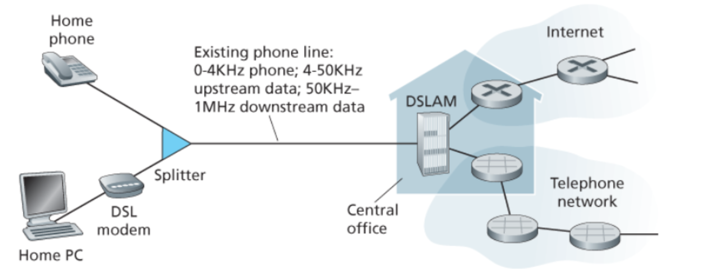
The alternative to DSL is *cable internet access* which uses the existing television service cable. Fiber optics will connect the cable head end to end users through fiber optics but generally the cable head end to the internet connection is done through coaxial cables hence the system being called a *HFC(hybrid fiber coax)*
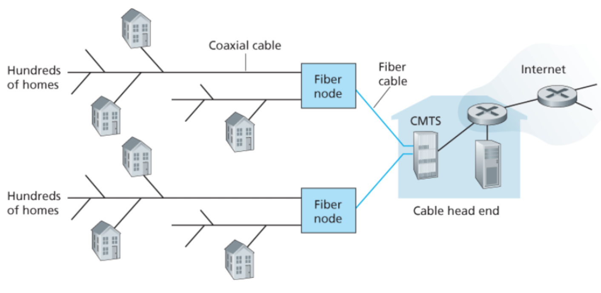
Yet another alternative is *FTTH(fiber to the home*. Each home has an optical network terminator that is connected to the neighbourhood splitter from which the connection to the central office happens through one shared fiber optic. 
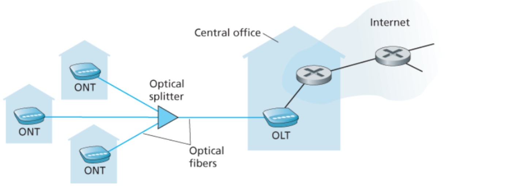

### Who owns the infrastructure?
The internet infrastructre is owned by ISP(Internet service provider). However, there isn`t one global company that dominates the market. 

### Circuit vs packet switching 
In packet switching, the router waits for the whole packet of information to arrive and only then will it proceed to the transmission to the destination. Another difference is that the information may be sent immediately even if all the transimission capacity is taken, the information will simply get queued. In contrast, circuit switching which for isntance telecommunication networks use, first ensures the availability of a line and only then may the transmission occur. This is akin to how one is assured to find a place at a restaurant that requires reservations vs one that does not require nor accept any.  

### Network of networks 
The first step into connecting to the internet starts with having an access ISP. 
--to complete

### Toolset of unix commands
```bash
// to list computer`s network interfaces 
ifconfig
// to map DNS names to an IP adress
host >target<
// to check if target is reachable 
ping >target<
// to list all routers between computer and target 
traceroute >target<
// establish a secure communication channel between computer and a remote one 
ssh >DNS or IP< 
```

## Evaluating a network 

### Evaluation metrics

The core network evaluation metrics are:

- Packet loss: fracion of packets lost from src to dst
- Packet delay: time taken for packet to get from src to dst 
- Average throughput: average rate at which dst receives data 

Generally one considers *packet delay* for small messages, and *average throughput* for bulk transfers. 

**transmission delay = packet size / link transmission rate**

**propagation delay = link length / link propagation speed**

**packet delay = transmission delay + propagation delay + queuing delay**  

### Queuing delay 

Queuing delay approaches infinity when arrival rate starts to exceed departure rate.

### Throughput and bottlenecks

**average throughput = min{R,R'}** where the R represent transmission rate of links on the line. Generally, the link with the slowest rate is known as the **bottleneck link** 

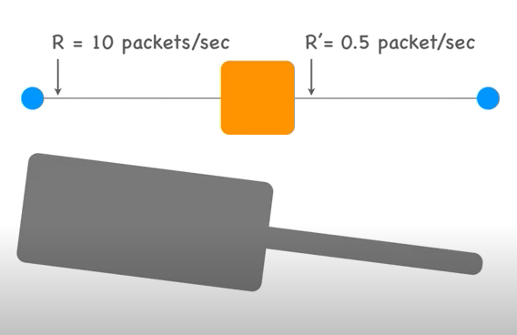

As we can see above, the word *bottleneck* is illustrative of what the slower link actually causes, it is essentially what determines how fast data is obtained at the dst. This is similar to pouring water out of a bottle that regardless of how wide it is, the pouring rate is determined by the neck of the bottle. 

Generally, a bottleneck is determined by a links transmisssion rate, or because of queuing delay. 

### Resource management

Inside a switch we find:

- queue: to store packets
- forwarding table: stores meta-data, indicates where to send each packet 

Now one can go two ways about getting a switch to transfer the data:

- **packet switching**: packets treated on demand, admission control & forwarding decision per packet
- **circuit switching**: resources reserved per active connection 

Both have their pros/cons;

**Circuit switching**:

+Predictable performance 

-Inefficient use of space as seen below. When reserved for one source, even if idle queuing space is present, it can not serve other users. 

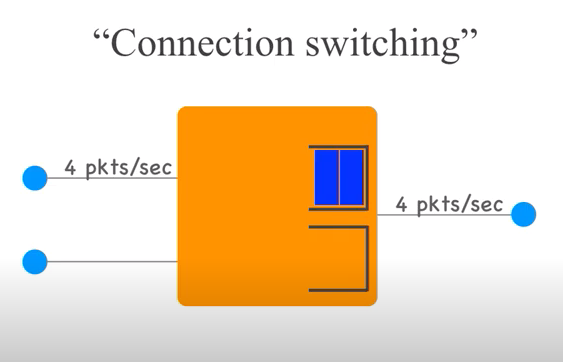

**Packet switching**:

+Efficient, good resource management 

-Unpredicatble performance 

Through packet switching, we are able to achieve **statistical multiplexing**, that is many users share the same resource simply because they are not all active at the same time. 

There exist multiple forms of achieving circuit switching: 

- Physical circuits: separate sequence of physical links per connection 
- Virtual circuits: manage resources as if there was a separate sequence of physical links per connection 
- Time division multiplexing: divide time into slots and reserve a time slot for each connection 
- Frequence division multiplexing: divide into frequency bans and reserve a band per connection, ie. radio stations 

### Security considerations

There are certain possible attack methods that might occur during a connection between Alice and Bob. 

- Eavesdropping: attacker will try to listen to the communication, obtain copies of data
- Impersonation: pretends to be Alice and extract information from Bob
- Denial of service: send loads of junk to Bob to disrupt communication between Alice and Bob 
- Malware: bad software on both sides 


## Application layer

### Network interface

Consists of an interface between an end-system and the network:

- piece of hardware or software that receives packets 
- network card on pc is a network interface

### DNS name

- identifies a network interface
- also called *hostname*, since an end system is also called a host 

### URL

- identifies a web object: for instance www.epfl.ch/index.html 
- identifies a format: DNS name + file name --> www.epfl.ch is the network interface, index.html is the file 

 ### Process

- piece of code that runs in application layer
- reachable at IP address + port number: 128.178.50.12 - 80(port number)
- port 80 is universally reserved for web server processes 

### Summary of a web request 

1. enter URL into web-client: (http://....)
2. web client extracts DNS name 
3. DNS is translated to IP adress
4. web-server process name is formed 


### Translating a DNS to an IP address

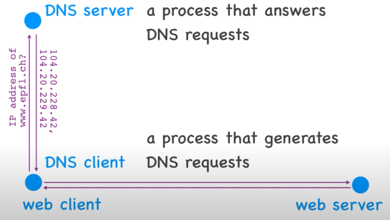

A DNS server is essentially a database that maps a bunch of DNS names to IP addresses. Now we naturally ask whether we could have one single DNS  server that serves the whole internet? This approach is not possible because it is not *scalable*. Instead we have a hierarchy of DNS servers:

- root server
- TLD(top-level domain) server (ie. .com, .org, .ch)
- authoritative server

In this hierarchy, each level server is able to reach its children servers. 

Now we said that DNS servers are distributed but how exactly does that work?

- every DNS client knows at least one local DNS server(physically close)
- one way that the root DNS server can get the IP address is through recursion: it asks the root server which asks the TLD server and so forth:

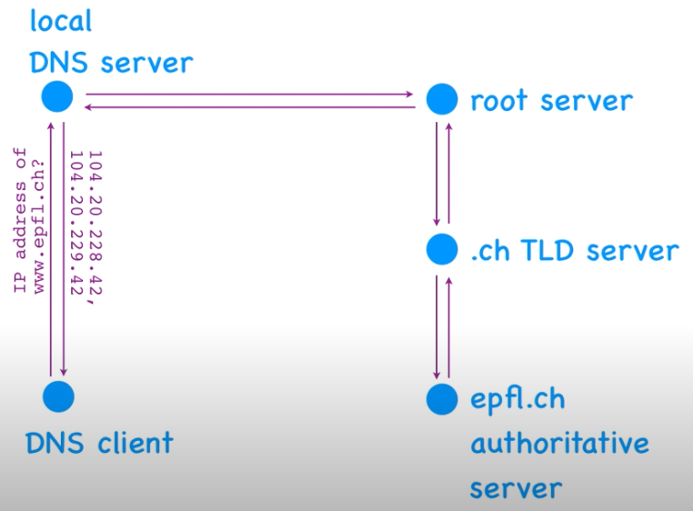

- the other approach is the iterative request method, the DNS server asks the root which returns the IP address of the TLD server and so forth: 

  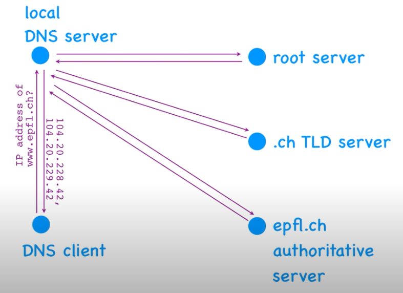

 ### DNS caching 

To be quicker and more efficient, DNS servers cache the responses they receive. To avoid stale data, each cached address comes with an expiration date. 

### DNS attacks

- (Impersonation attack) If Persa knows that the client has asked for some IP address and is able to send a response quicker than the DNS server, this will lead to a malicious connection established and the client will simply ignore the response of the DNS server: 

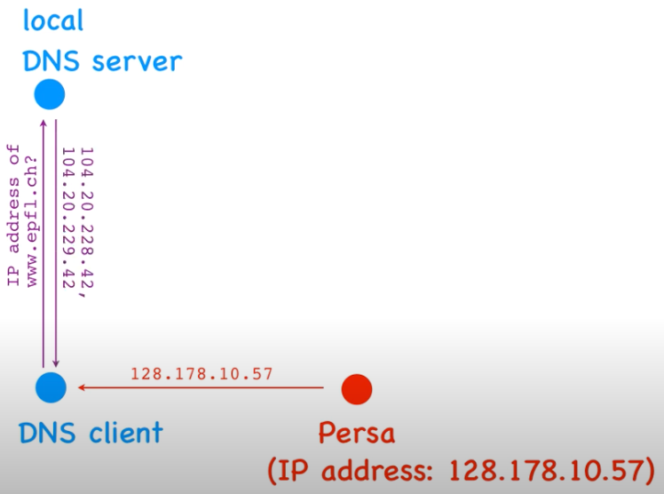

- (Denial of service) Denis could launch a denial of service attack to all servers in the DNS hierarchy: 

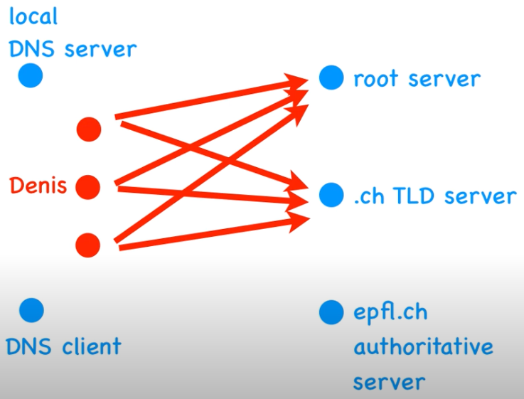

- (Trashing) Trish could launch an attack to affect the performance of the DNS server by sending request for a lot of unpopular websites such as `X.com` eventually leading to the cache becoming full and losing data of more popular websites. 

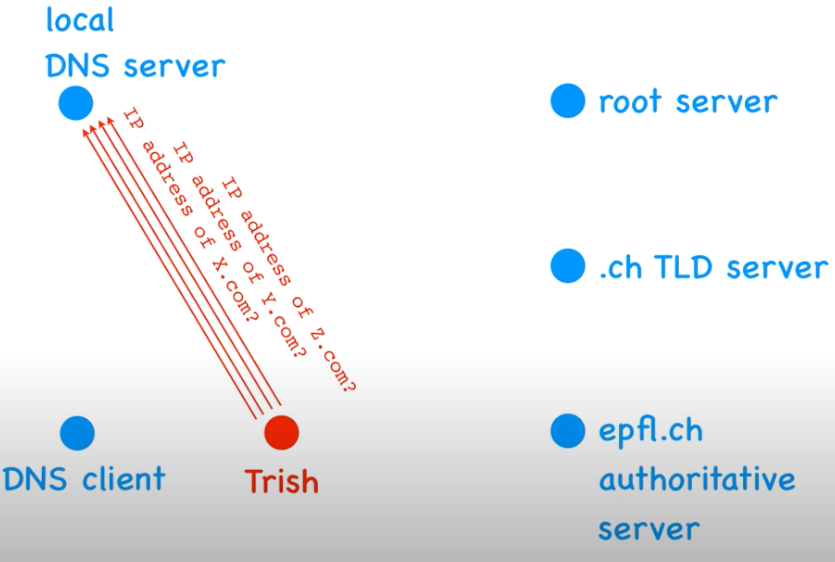

### File distribution 

We saw two architectures for file distribution:

- Client-server: time increases linearly with the number of clients
- Peer-to-peer: time increases sub-linearly with number of peers 

Hence peer-to-peer scales better than client-server 

### Example: Peer-to-peer vs client-server

Let's take an example. Suppose Alice wants to share a file with 3 other friends:

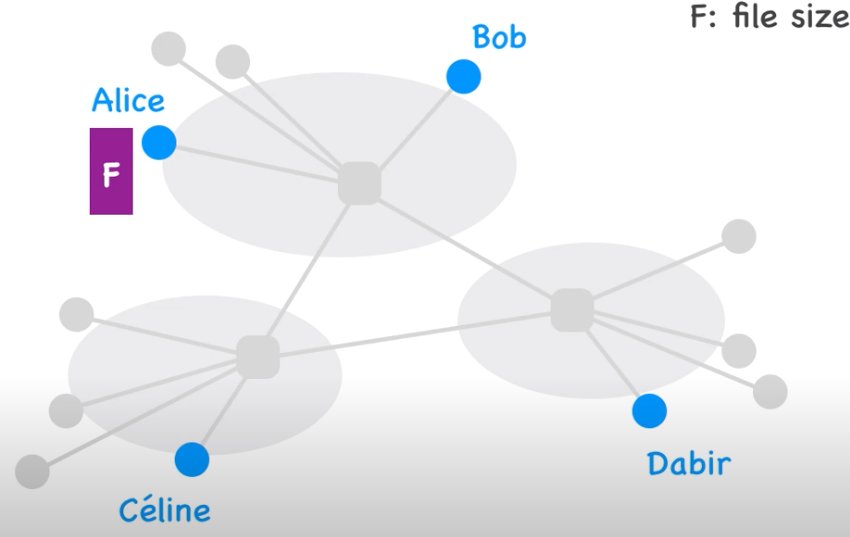

Now let's first take the **client-server** case:

The file distribution time(D_cs) is as below: 

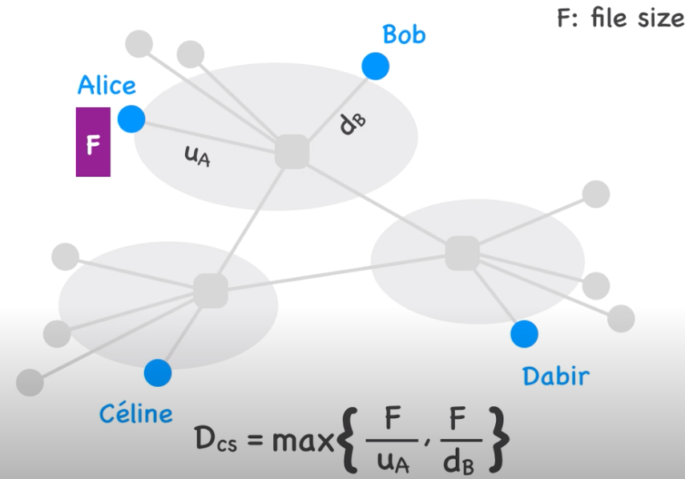

### Retrieving content from a P2P file distribution system

Content is a set of data files, stored in a peer. Each content has a **metadata** file which stores:

- file identity
- location information

To retrieve content:

- learn metadata file ID
- find metadata file location
- get metadata file
- find data file location
- get data files 

### Finding metadatafile location 

- Tracker: end-system that knows locations of the files: IP addresses of peers that store each file 
- Distributed hash table: distributed system that knows locations of the files 
- both can be seen as blackboxes that as input take file ID and output IPs of peers that have the file 

### Getting metadata file

- is either on a web server
- or stored on a peer which means we learn its ID from a web server and location from a tracker or DHT 

### P2P DHT

- peers partition filespace(ie. each peer owns certain file IDs)
- to say a peer owns a file ID does not mean it stores it, it simply means that it knows where it is 

## Transport layer 

The transport layer is sandwiched between the application layer and the network layer. 

Here is what the transport-layer header looks like:

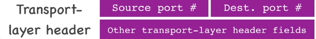

And some new terminology, that is **datagram** and **segment**. Every segment is included inside a datagram. 

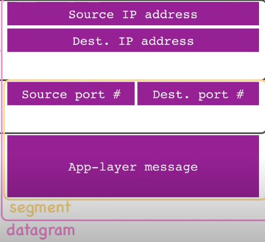

### UDP 

**Sending side**
- Transport layer asks application layer to create a process(called a socket). 
- application layer binds socket to a IP adress and a port number 
- process is ready to send a message
- transport layer puts together a packet which is essentially the **segment** mentioned earlier on 
- when the process is done, transport layer will delete the socket 

### TCP 
- the first couple steps are the same as UDP, that is a socket is create and bound to an IP adress and a port 

A TCP socket has:
- listening & connection sockets 
- each connection socket has a unique(local IP,local port, remote IP, remote port) tuple 
- a process must use a different TCP connection socket per remote process 

Thus at the heart of TCP is the notion of **process-to-process** communication whereby we have:

- Multiplexing: 
  -- upon receiving a new message from a process, create new packets 
  -- identify the correct IP address and port 


- Demultiplexing: 
  -- many processes running in app layer
  -- upon receiving a new packet from the network, identify the correct dest. process  

### Reliable data delivery 

Data delivery becomes unreliable because the network layer may potentially drop data. Thus the transport layer must compensate for this.

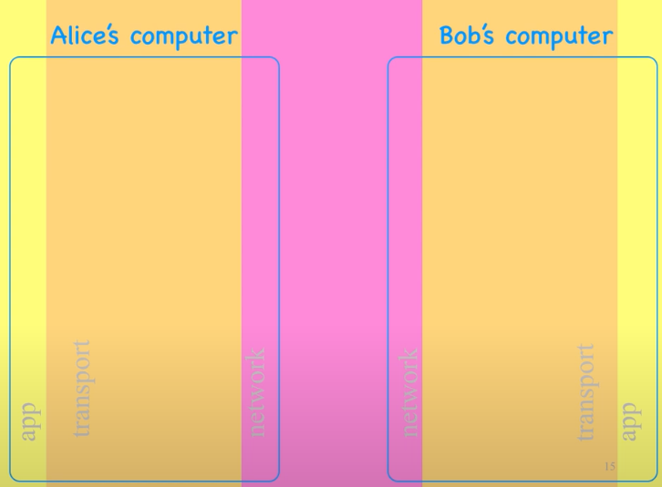

To determine if data was corrupted, we use a checksum which is:

- redundant information, ie. binary sum of all data bytes 

- sender adds checksum C to each segment 

- the checksum is used to communicate acknowledgments between the two sides:

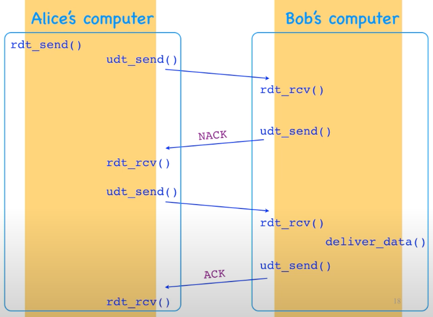

- the acknowledgment is a piece of **feedback** from the receiver to the sender which is added to every segment 


Now consider what happens when the *ack* itself is corrupted. 

- every segment sent by alice gets assigned a sequence number

- each time alice sends something, a timer is started which will timeout if it doesn't receive an ack in due time, it will then send the data again 

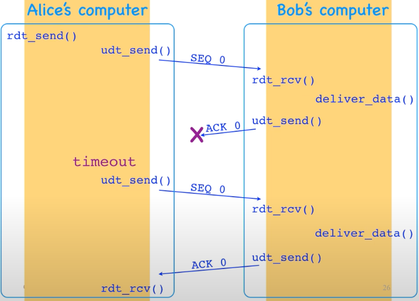

So let's summarize the basic elements of reliable data transmission:
- checksum: detects data corruption
- ACK, retransmission, SEQ: overcome data corruption
- Timeout, ACK, retransmission, SEQ: overcome data loss 

### Pipelining 
Now here is a little inefficieny in our system. When Alice's transport layer sends a message, it remains in idle state for a long time until it receives the ack. The time of it being busy is expressed by the sender/channel utilization ratio. 

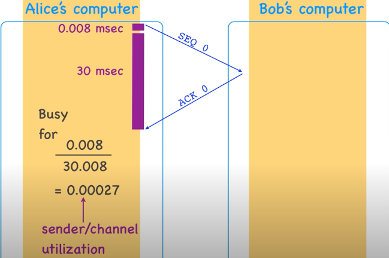

A way to make this more efficient is by sending multiple segments without waiting for an ack. Each time she receives an ack, she advances the window and sends the next patch of segments. The **window size** is the maximum number of unacknowledged segments Alice has sent. 

### Data loss in pipelining 

Go-back-N model: 
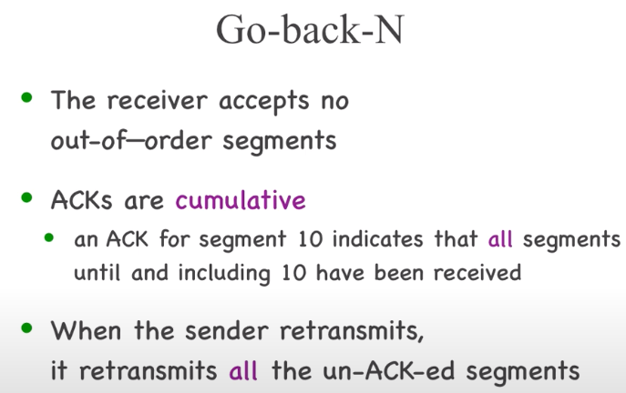

Selective repeat model: 

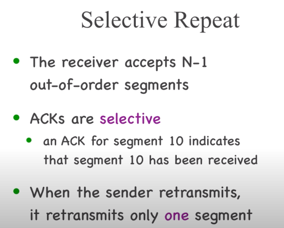

Note that TCP is a mix of Go-back-N and SR since it uses cumulative ACKs but retransmits 1 segment. 

## More details on transport layer protocols 

**UDP** provides checksums to detect for corruption 

Process running on Alice's side called `rdt_send()` is called.  This puts data into a segment and will call `udt_send()`. This will travel to Bob where `rdt_rcv()` gets called. Then Bob's transport extracts the data using `deliver_data()`. The only extra layer of security that UDP adds is a check for corruption. 

Meanwhile, TCP will add `checksum`, `ACKs`, `SEQs`, `timeouts`, `retransmissions` at the cost of being slower. 

**TCP** (seqs and acks)

Here is a sample TCP process: 

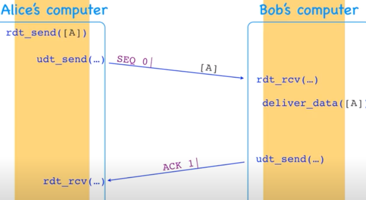

We define **SEQ** as number of the first data byte, and **ACK** is the number of the next data byte. 

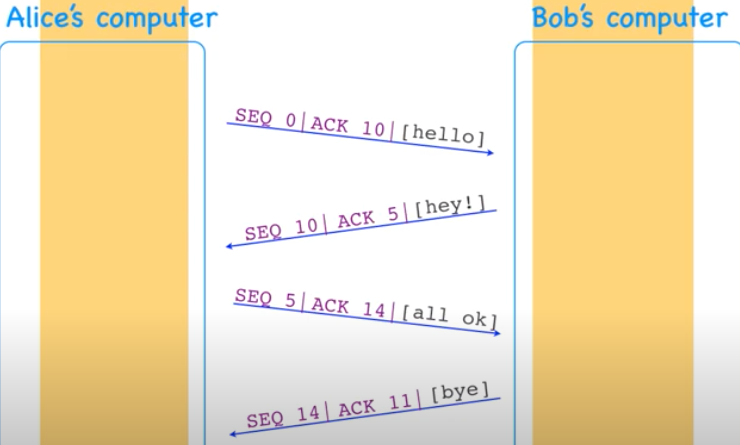

 In the above we see that Bob replies with an ACK 5 because  he has received 4 bits from Alice and is waiting now for the 5th bit. 

Some simple facts about TCP:

- TCP connection may carry bidirectional data
- A segment may or may not carry data
- There exists a maximum segment size 

**TCP timeouts and retransmits**

 TCP timeouts are purely emprical, in that they rely on times that simply are known to work.  

Now here's a little problem: 

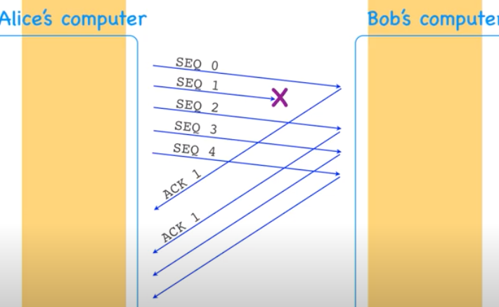

What ACK number must Bob respond with after receiving SEQ2 but having failed to receive SEQ1? Since ACKs are cumulative, Bob responds with ACK1.  Receiving a bunch of duplicate ACKs, Alice will perfrom a *fast retransmit*.

Thus in TCP, we have 2 types of retransmission triggers:

- Timeout: retransmission of oldest unacknowledged segment
- 3 duplicate ACKs: fast retransmit of oldest unacknowledged segment 

**Connection setup and teardown**

 When Alice wants to communicate with Bob, her side opens a connection socket, and Bob's side opens a listening socket. A connection setup request is a *segment* form `SYN|SEQ x|ACK -` . Once the listening socket accepts the request, it will create a connection socket on Bob's side. Then both sides create a send and receive buffer. 

A connection setup follows a **3 way handshake** wherein:

- TCP client: end-system initiating handshake
- TCP server: other end-system 
- First 2 segments always carry SYN flag which is a 1-bit field in TCP header 

**TCP connection attack**

When Jack knows that Alice is requesting a file from Bob, he may send a segment identical to what Bob would send in which case Alice would ignore what she receives from Bob. So how do we prevent this? When Alice and Bob set up the connection, they must choose random sequence numbers that are hard to guess. 

**SYN flooding**

When Alice tries to establish a connection with Bob, Bob will keep all previous requests in a buffer. Thus, Denis may send a lot of incomplete connection requests to flood Bob's connection buffer. Here's how we prevent this: 

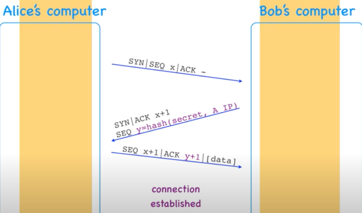

When Bob sends a hadh of some secrete to Alice and Alice returns this hash+1 as an ACK, Bob will know it had agreed to connect with Alice before. 

**Flow control**

Bob communicates to Alice how much he can receive. 

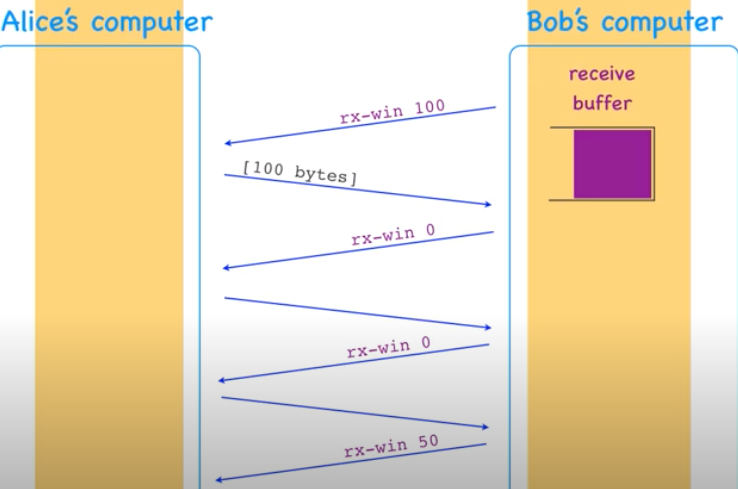

**Congestion control**

Here the goal is to not overwhelm the network. The **congestion window** is the number of unacknowledged bytes that the sender can transmit without creating congestion. Alice will send data at a rate *R* with round trip time *RTT* . We define the **bandwith delay product** as *R x RTT* which is the maximum amount of data Alice can transmit before receiving an ACK which is **equal** to the maximum congestion window size. 

**Self-clocking**

Alice will send more data if she observes she can and slow down if she times out:

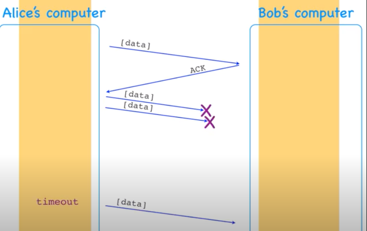

**Window size algorithm**

- exp: Alice will double the number of unacknowledged bytes sent(denoted N aka. **MSS**), which will by definition double the congestion window 
- linear: Imagine Alice tries with N=400 and has a timeout. Observing that SEQ 300 onwards have failed, she will then set *ssthresh* to 200. She now sets N=100 and then to N=200. Now previously, we had a timeout at N=200 so it makes more sense to increase N by 50 to 250. 

**Tahoe algorithm**

Tahoe uses a combination of exponential and linear increase:

- Set window to 1 MSS, increase exponentially
- On timeout, reste window to 1 MSS, set sstresh to last window/2
- On reaching sstresh, transition to linear increase 

## Preparation notes for midterm 

### Notes from HW2

**Important points on application layer**

- The DNS servers that together implement the DNS distributed database store **resource records (RRs)**, including RRs that provide hostname-to-IP address mappings. An **RR** is a 4 tuple of shape `(Name, Value, Type, TTL)`:

  -  If *Type=A*, then *Name* is a hostname and *Value* is the IP address for the hostname. Thus, a Type A record provides the standard hostname-to-IP address mapping. As an example, (***relay1.bar.foo.com***, 145.37.93.126, A)* is a Type A record.

  -  If *Type=NS*, then *Name* is a domain (such as **foo.com**) and *Value* is the hostname of an authoritative DNS server that knows how to obtain the IP addresses for hosts in the domain. This record is used to route DNS queries further along in the query chain. As an example, *(***foo.com***,* **dns.foo.com***, NS)* is a Type NS record.

  -  If *Type=CNAME*, then *Value* is a canonical hostname for the alias hostname *Name*. This record can provide querying hosts the canonical name for a hostname. As an example, *(***foo.com***,* **relay1.bar.foo.com***, CNAME)* is a CNAME record.If *Type=MX*, then *Value* is the canonical name of a mail server that has an alias hostname *Name*.

    As an example, *(***foo.com***,* **mail.bar.foo.com***, MX)* is an MX record. MX records allow the hostnames of mail servers to have simple aliases. Note that by using the MX record, a company can have the same aliased name for its mail server and for one of its other servers (such as its Web server). To obtain the canonical name for the mail server, a DNS client would query for an MX

Here is a summary of a chain of DNS and HTTP protocol requests:

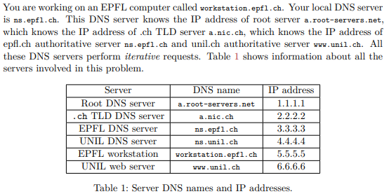

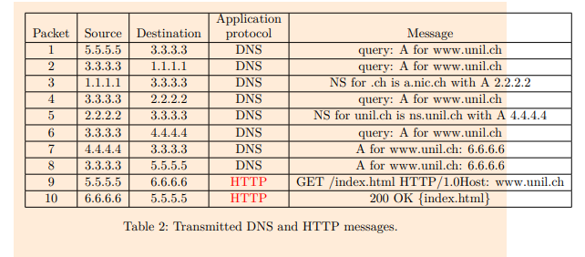

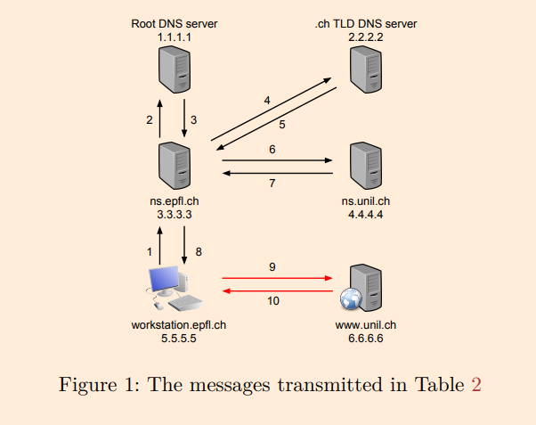

You are an ordinary user (not a network/system administrator), and your computer is inside the EPFL network. All computers in this network use the same local DNS server.

Can you find out whether a given external URL, e.g., www.mit.edu, was recently accessed by another EPFL user?

**Answer**:  Yes, we can use dig to query that website in the local DNS server. For example, dig example.com will return the query time for finding example.com. If example.com was just accessed a couple of seconds ago, an entry for example.com is cached in the DNS cache of the university’s DNS server, so the query time is negligible (almost 0 msec). Otherwise, the query time is large.

More on retrival times:

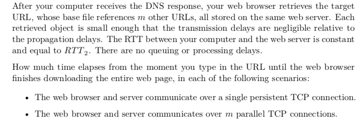

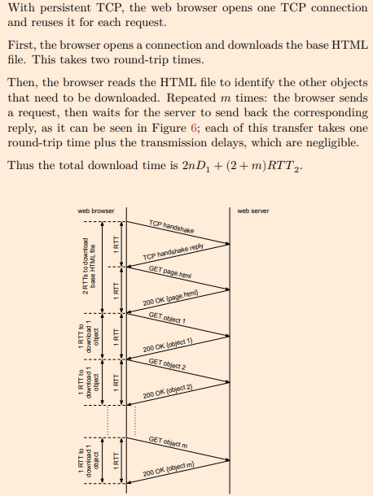


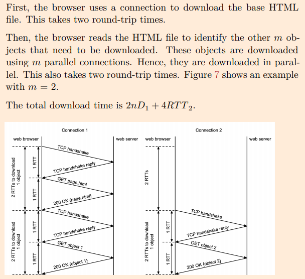

Hence the case with parallel connections leads generally to a lower download time. 


## Notes from HW3

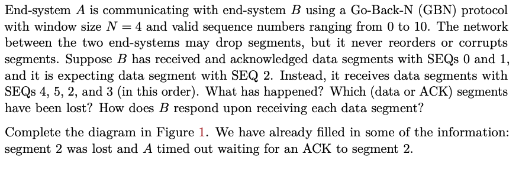

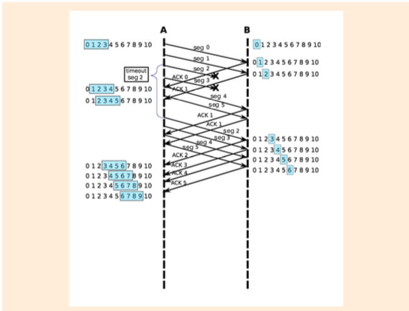


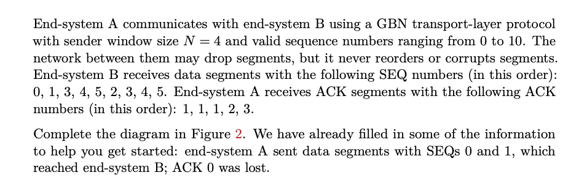

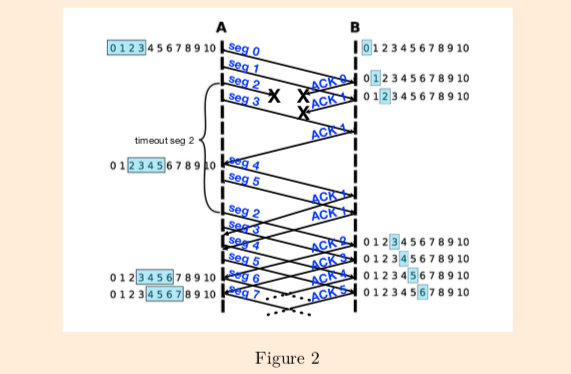

And more challenging case with a lot of corruption in the ACK: 

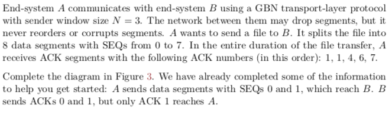

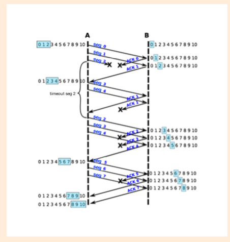

**Selective repeat vs. go back N | When to choose one over the other**

- SR is expected to achieve higher sender utilization and throughput than GBN when there are few, independent segment losses.

- GBN is expected to achieve higher sender utilization and throughput than SR when there is bursty loss on the reverse channel (many ACKs get lost back to back).

And here is a question that sheds more light on what features we need given the type of our channel: 

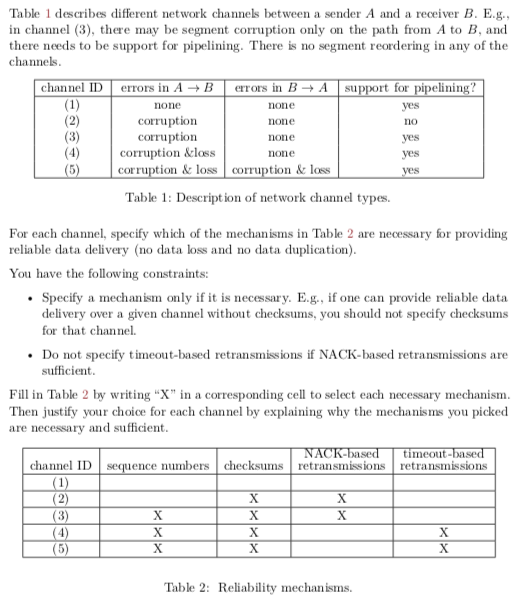

##  Notes from HW 1

Remembering some key terms:

- **Transmission delay**: amount of time to push all N bits into the link = **packet size / link transmission rate** 

- **Propagation delay**: amount of time to move 1 bit from one end of the link to the other = **link length / link propagation speed** 

- **Packet delay = transmission delay + propagation delay + queuing delay**  

- **Bandwith delay product**: R * d_{prop} (intuition: max number of bits that can be transmitted on link at any time)

- **Average throughput**: data size/transfer time

- We would solve the below question remembering that the average throughput is the smallest transmission rate across all links.

  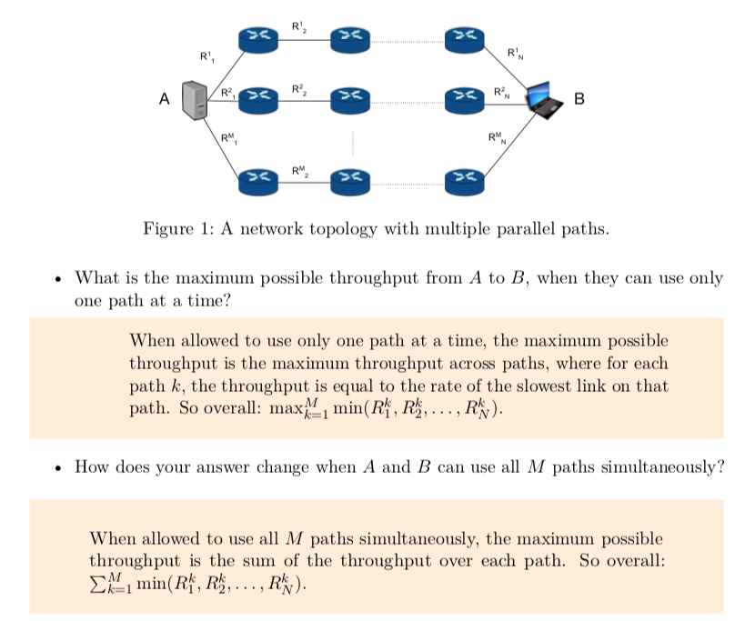

  - Let's now build some intuition for packet delay diagrams and properly see how the transmission delay, propagation delay and queuing delay: 

    **Store and forward model**

    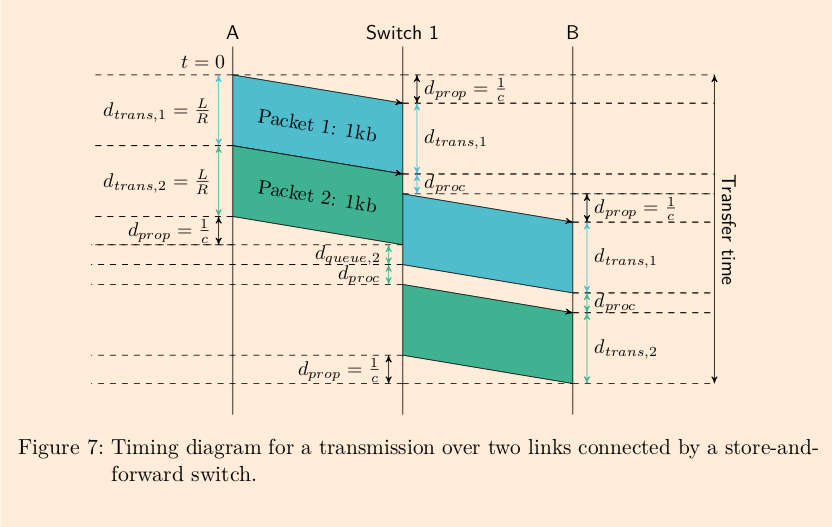

  **Circuit switching**

  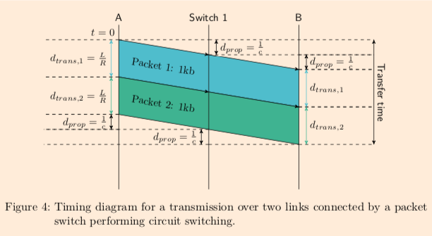

The two models differ by the d_{proc} delay. 

**Store forward with multiple switches and multiple back to back packets, what happens?**

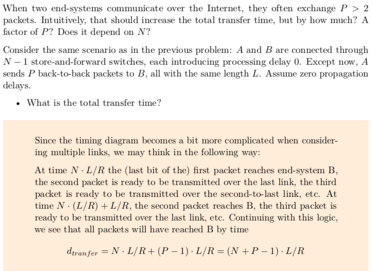

### Midterm paper review

**2019**

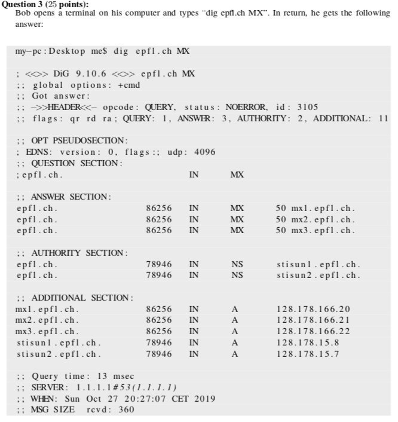

We must remember that each end system listens at a given port number based on the service provided. 

RTT definition: **Round Trip Time** (RTT) is the length **time** it takes for a data packet to be sent to a destination plus the **time** it takes for an acknowledgment of that packet to be received back at the origin.

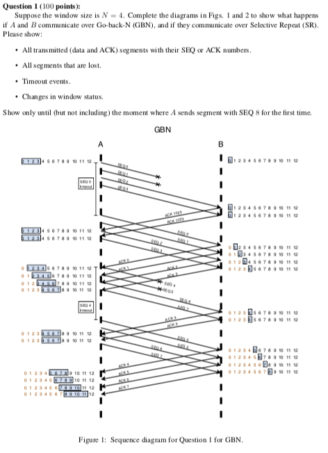

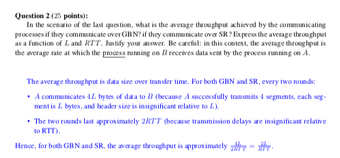

- When there is network congestion, packet losses become frequent. In such a case, an SR process is more efficient since GBN will retrasnmit all unacknowledged segments. 

- Transmission delay over CS vs P2P distribution:

  **Delay over CS exam question**: max{F/u_{a}, F/d_{b}}, u_{a}= upload Alice, d{b}= download Bob

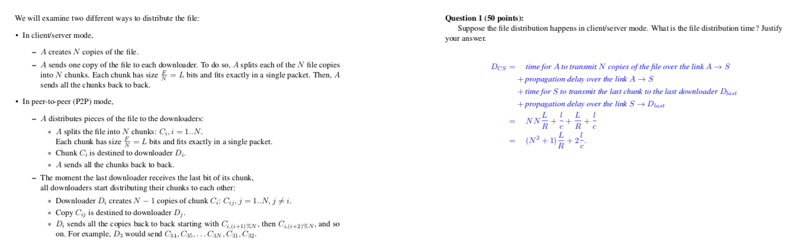

**Delay over CS and P2P formulae**: 

Case 1: 1 Client over CS

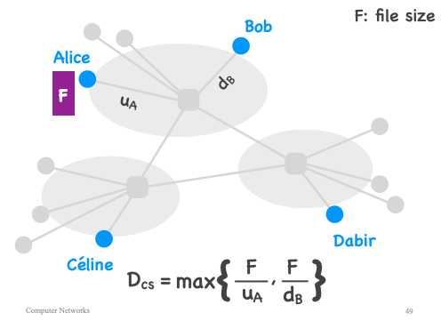

Case 2: Multiple clients over CS

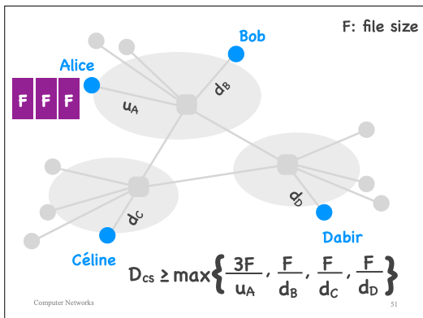

Case 3: General formula

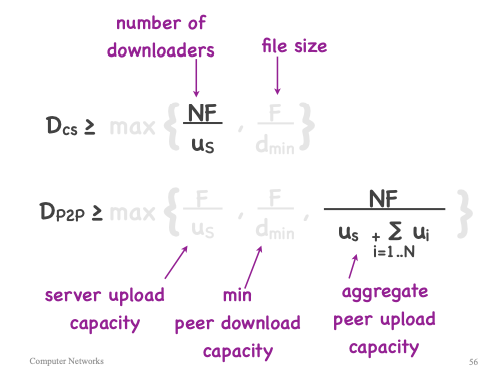

And some intuition: 

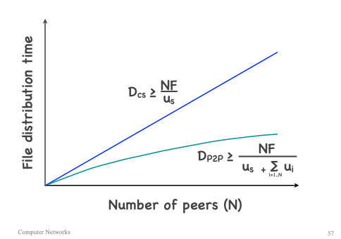

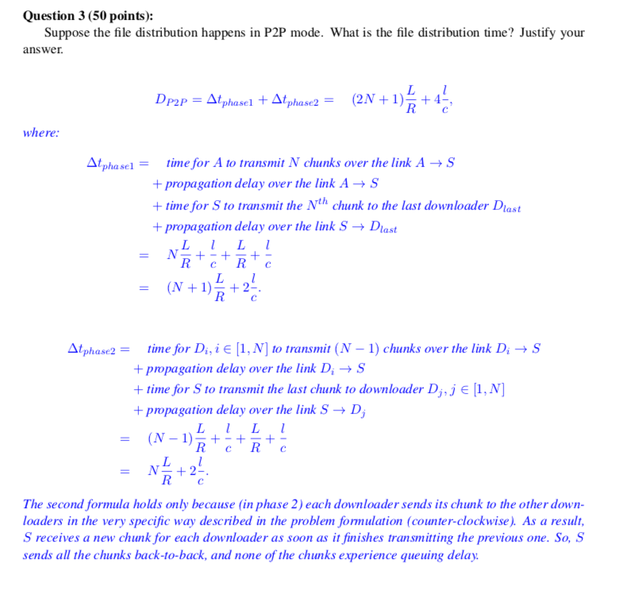

**2018**

Typical transport layer problem: 

Point to highlight here is that *UDP* is used for DNS requests whereas *TCP* is used for HTTP requests. 

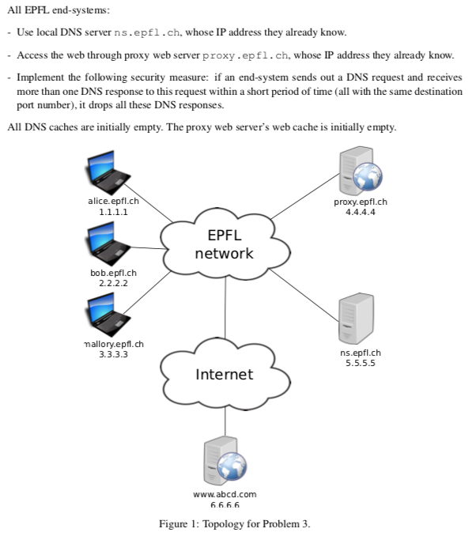

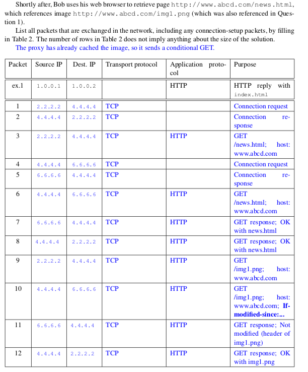

Example DOS attack to direct to a fake website:

Question: Mallory knows that Bob is about to access a new page, http://www.efgh.com/index.html, and wants to make him access a fake page from her machine instead.Can she do this? If no, explain why. If yes, explain in which scenario she can do it and how. Recall that EPFL machines implement a special security measure.

*She can, in the scenario where nobody has accessed www.efgh.com before the attack, such that the proxy web server has not cached www.efgh.com’s correct IP address. Mallory can guess when the proxy web server sends a DNS request for www.efgh.com’s IP address and send a fake DNS response, i.e., impersonate the local DNS server.To circumvent the security measure, she needs to prevent the local DNS server from responding to the proxy web server’s DNS request. She can do this by launching a denial-of-service attack against the local DNS server, e.g., flooding the link to the DNS server with enough traffic to cause congestion, such that the proxy web server’s DNS request is either dropped or significantly delayed.*

Typical transmission problem:


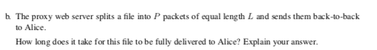

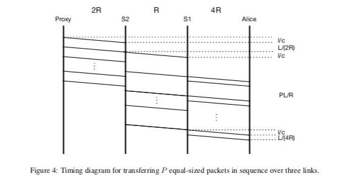


## Network layer

**Basic functions**

- forwarding
- routing 

**Two types**

- virtual circuit networks
- datagram networks 

A *router* is known as a network layer switch. The router stores some mapping that links each header value it receives to some output link:

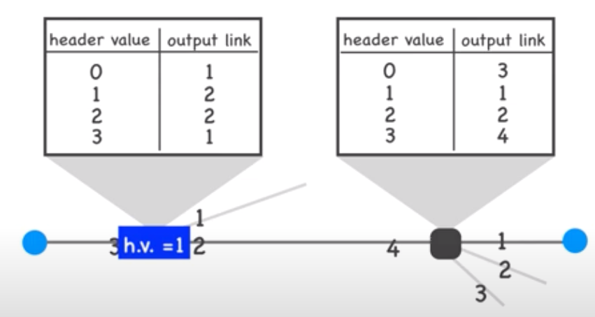

**Forwarding**

- Is a local process that takes place at a router and determines output link for each packet 

**Routing algorithms**

Option 1: (routing table computed by one central router that knows all others)

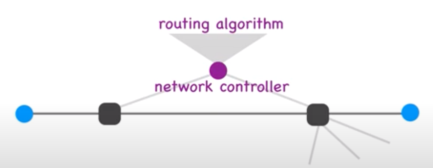

Option 2: (routing table found collaboratively by all routers)

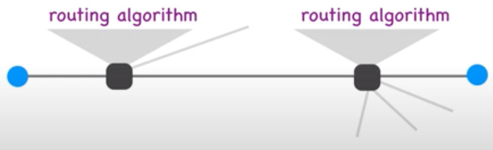

**Forwarding**: determines output link for each packet

**Routing**: populates forwarding tables 

**Network layer types**

- virtual-circuit:
  - uses connection switching, guarantees performance 

- datagram network 

**Connection&State**

To say that a set of entities have established a connection, it means that they keep a certain state about each other which they can use to synchronize with each other. 

**Problems with state in the network layer**

A problem with the virtual circuit approach is that a router in the middle of the internet would require large amounts of memory to store state about all its communications. Another issue is security, an attacker can setup multiple routers and flood the forwarding table of the router. 

**Datagrams**

- uses packet-switching, that is no network-layer connection
- appropriate for best-effort service(the network does not provide any guarantee that data is delivered or that delivery meets any quality of **service**)

Each router maps a certain range of IP addresses to an output link. 

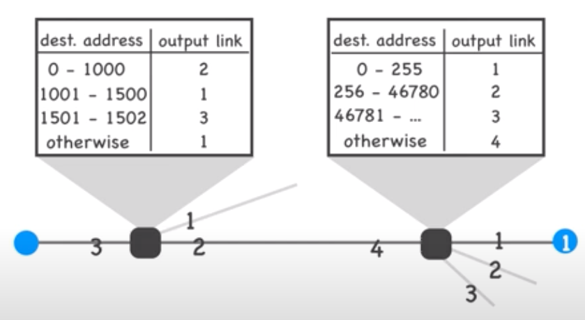

The mapping may be done by extracting the common binary form of the given range. 

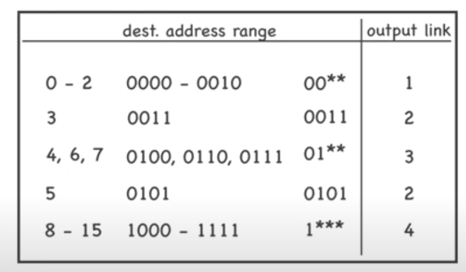

**Why IP addresses must be location dependent**

This will reduce the forwarding table size because end-systems in the same range can map to the same prefix. So we have that:

- address proximity implies location proximity 

**IP address format**

- number from 0 to 2^32 -1 

- we present in dot format, ie:

  ​	1101111 00000001 ......

  ​	becomes

  ​	223.1.1.1

- IP prefix: range of IP addresses represented by mask, covers all IP addresses whose M MSB's are the same, ie: 223.1.1.*(the prefix)

**IP subnet**

- is assigned an IP prefix 
- is a contiguous network area that does not contain any routers 
- all its end-systems and incident routers have IP addresses from the same IP prefix 

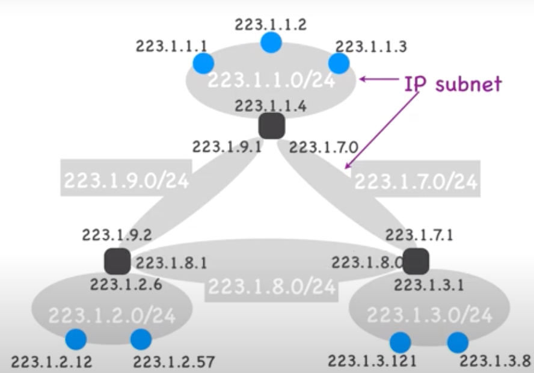

**IP NAT**

Since we are slowly running out of IP address capacity with increasing size of devices connecting to the net, we need a solution such as IPv6. But as an alternative, *Network address translation* allows a single device, such as a [router](https://computer.howstuffworks.com/router.htm), to act as an agent between the Internet (or "public network") and a local (or "private") network. This means that only a single, unique IP address is required to represent an entire group of computers.(taken from howStuffWorks)

**How a NAT router maps to the correct device**

When some device inside the NAT sends data, the below state is created 

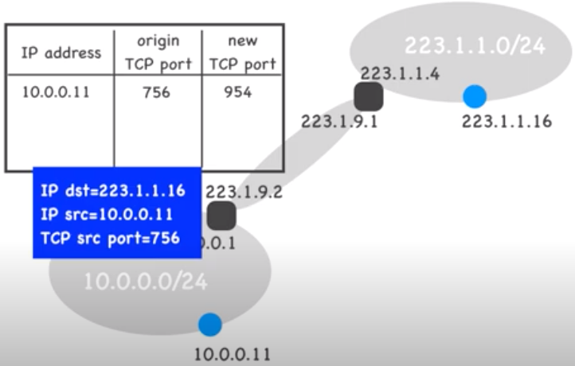

**Issues with NAT**

- It is a complex setup when an end-system outside of the  subnet wants to communicate with an inner end system since its IP is ambigious. 

**Summary of IP forwarding**

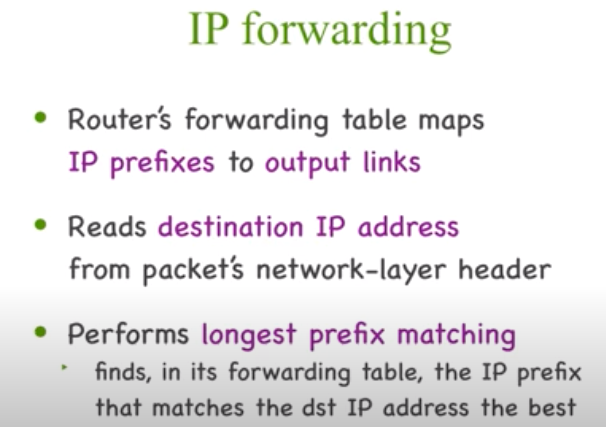

**Least cost path routing**

*Using Dijkstra*

Imagine trying to reach the IP 8.0.0.1. Every router in the world has in its forwarding table an output link that specifies the output link to reach this IP.

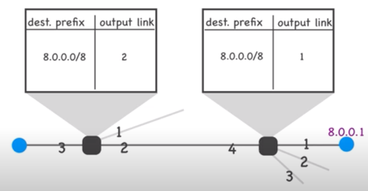

Imagine a set of first-hop routers(those routers located at the edge of a subnet) 

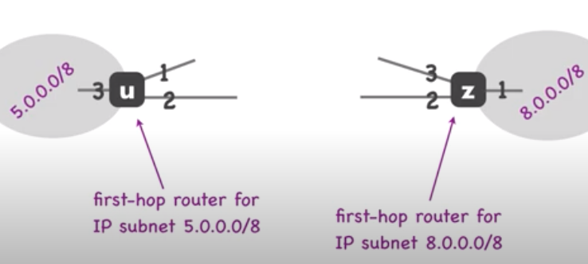

The problem is, each router knowns how to access routers in its own subnet, but how will u know how to access z and vice versa? Well, for that we need a routing protocol. Imagine just a bunch of networks as below, we define a cost between networks as the sum of the delay for a roundtrip. 

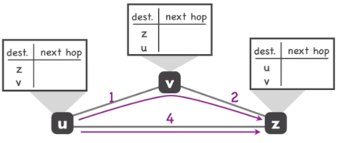

Now let's study the Dijkstra algorithm to find the least cost path. Here are the steps along with visuals:

- For some router u, we create a table of all destinations

- It first considers whether it can reach the routers and adds a cost, if there is an intermediate step, then for the time it can't reach that router 

  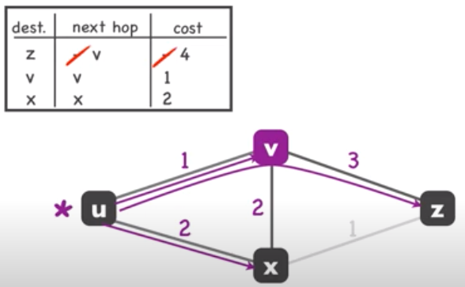

- Then finally, for every router it can not directly reach, it considers whether intermidiary routers can help it reach it and always adds the router that lowers the cost. 

**Link-state vs. distance-vector**

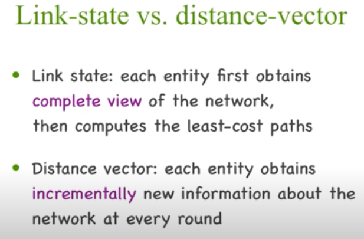

**Network security**

Some security properties:

- Confidentiality: only sender and receiever understand contents of message 
- Authenticity: message is from whom it claims to be 
- Integrity: message was not changed along the way 

## Link Layer

Here is how it compares to the network layer:

- the network layer takes each packet from one of of network to the other end, whereas the link layers takes each packet from one end of one link to the other end or better said:
  	- link layer takes packet from one end of one physical link to the other end
  	- network layer takes packet from one end of IP subnet to the other end 

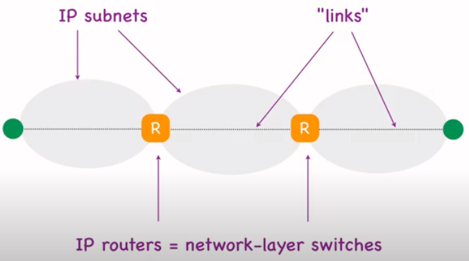

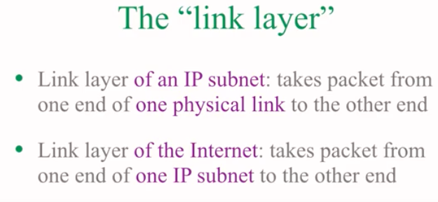

Some link layer services:

- Error detection;
  - receiver detects and drops corrupted packets
  - relies on checksums 
- Reliable data delivery 
  - sender/reciever detect corruption and loss and try to recover 
  - relies on checksums, ACKs, retransmits 
  - only for error-prone links
- Medium access control(MAC)
  - sendder manages access to shared medium 
  - listens for ongoing transmissions
  - backs off and retries later 

**Ethernet**

*Addressing*

 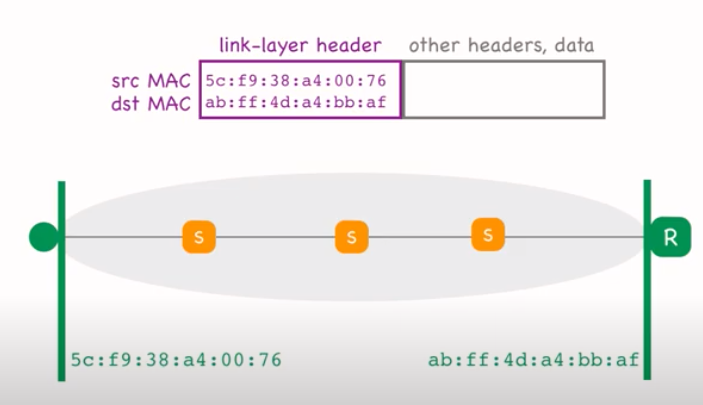

MAC address properties:

- 48 bit number:
  - each byte is in hexa
- Flat:
  - not hierarchical like IP
  - not location dependent 

*Forwarding*

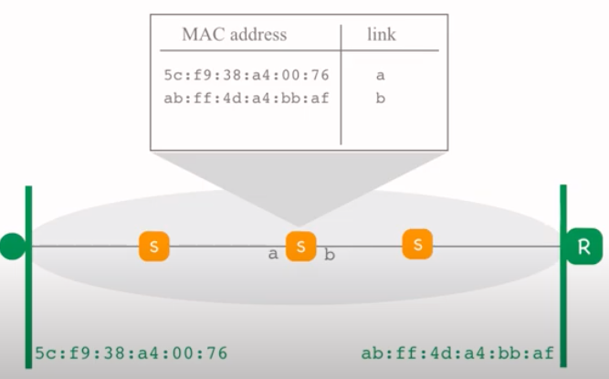

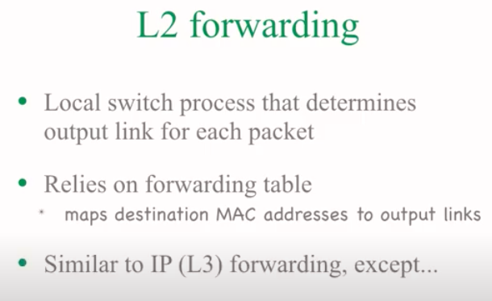

except the fact that L2 is flat so it can not rely on stuff like prefixes. 

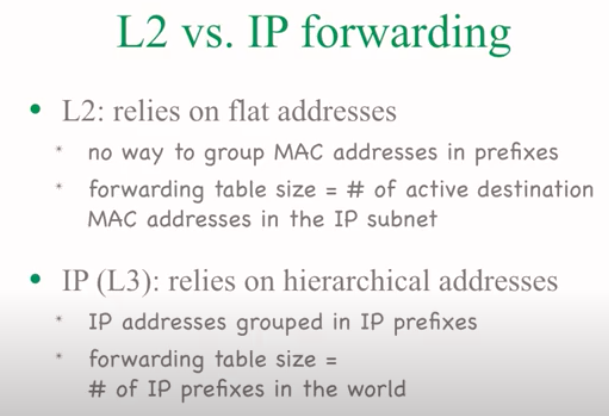

*Learning*

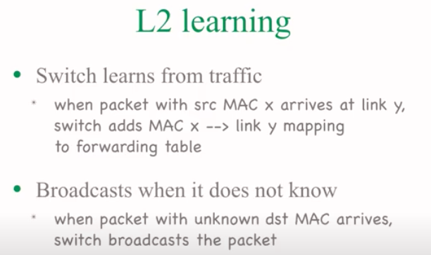

*Address resolution*

ARP request:

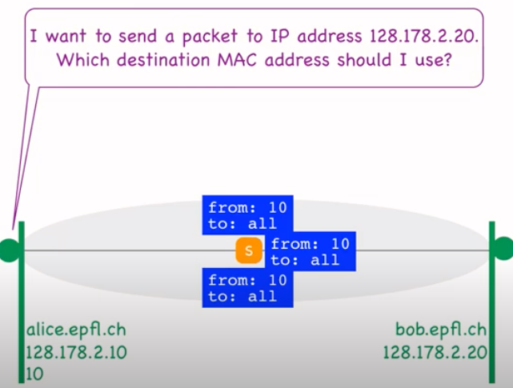

