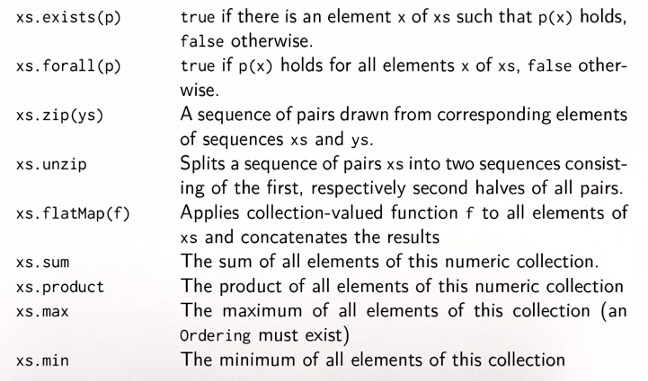
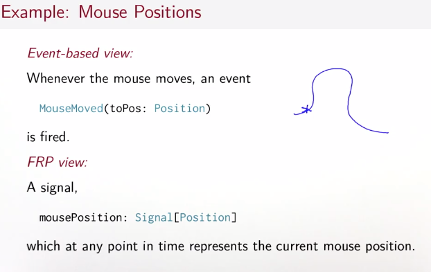
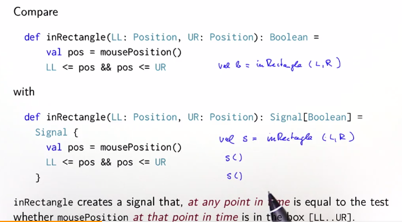
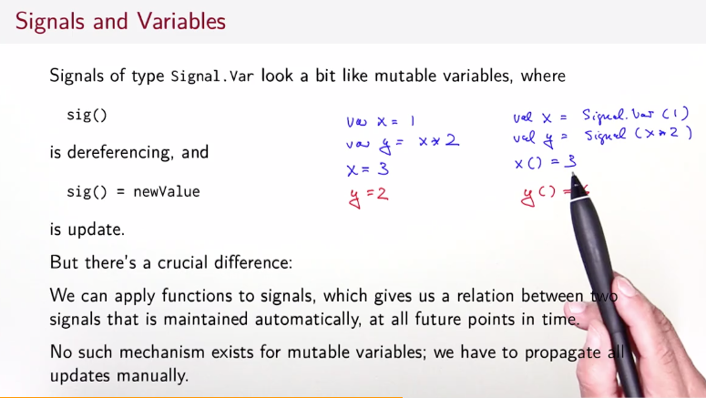
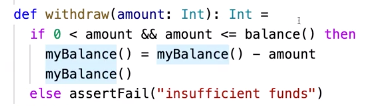
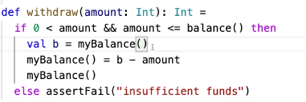
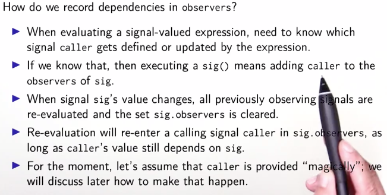

# Functional programming 

## Week 1

****


### Evaluation strategies: **call by name** vs **call by value**

Suppose we have a program in scala that runs `sumOfSquares(3, 2+2)`. The call-by-value model would produce:
```scala
sumOfSquares(3, 2+2)
sumOfSquares(3, 4)
square(3) + square(4)
3*3 + square(4)
9 + 4*4
9 + 16
25
```
Whereas the call-by-name model would produce 
```scala
sumOfSquares(3, 2+2)
square(3) + square(2+2)
3*3 + square(2+2)
9 + square(2+2)
9 + (2+2)*(2+2)
9 + 4*(2+2)
9 + 4*4
25
```

The advantage of call-by-value is that every function argument is evaluted only once. In the second snippet, we see how 2+2 is evaluated twice. However, call-by-name has the advantage that a function argument is not evaluated if a parameter is unused in the evaluation of the function body. 

Consider this example:
```scala
def test(x: Int, y: Int) = x*x
// which evaluation method is more efficient?
test(3+4,8)

//CBV
7*8
//CBN
(3+4)*8
3*8 + 4*8
```

We can also have that a program will terminate under CBN but not under CBV and vice versa. For instance:

```scala
def first(x: Int, y: Int) = x
first(1,loop)
//CBN
1
//CBV
first(1,loop)
.
.
.
.
```
Scala normally uses CBV. But if the type of a function parameter starts with a right arrow it will use CBN. To demonstrate this, we define the and function making sure its second argument is call by name:

```scala
def and(x: Boolean, y: => Boolean): Boolean =
if x then y else false 
```

## Week 2

****


### Higher order and anonymous functions

A higher order function is a function that takes another function as argument. Here is an example: 

Suppose we want to take the sum of all integers between some lower bound *a* and an upper bound *b*. We may recursively define

```scala
def sumInts(x:Int, y:Int):Int = 
	if (x > y) 0
	else x + sumInts(x+1,y)
```

We could also define the same but for cubes 

```scala
def sumCubes(x:Int, y:Int):Int = 
	if (x > y) 0
	else cube(x) + sumCubes(x+1,y)
```

However we could make the code more generic and define a general sum function that takes as first argument a function, namely the rule to apply and this way if we also wanted to define some ` sumFactorial` we could simply use the `sum` function. Consider

```scala
def sum(f: Int -> Int, a:Int, b:Int):Int = 
	if a > b then 0 
	else f(a) + sum(f, a+1, b)
```

Then we could easily define 

``` scala
def id(x: Int):Int = x
def sumInts(a: Int, b: Int):Int = sum(id, a, b)
```

Now notice how we tediously had to define an `id` function. Instead we may define `id` anonymously, it would then look like

``` scala
(x:Int) -> x 
```

and then define `sumInts` as 

``` scala
def sumInts(a: Int, b: Int):Int = sum((x:Int) -> x, a, b)
```

Anonymous functions are *syntatic sugar*, that is they make life nicer, but not really essential since we can always go the tedious def way. 


### Currying

The idea behind currying(named after Haskell Curry) is that we are able to desribe a function that takes multiple arguments as a composition of functions that all take one argument. The point of currying is that it takes a function and provides a new function with the parameter applied. For instance, we apply currying to find the product of the square of numbers in a given range as follows:

```scala
def product(f: Int => Int)(a:Int, b:Int): Int = 
	if a > b then 1 else f(a) * product(f)(a+1,b)

// function call
product(x => x*x)(1,5)
/**
will print 14400 = 4*9*16*25
*/
```

### Functions and Data

Suppose we want to define a *rational* type, we would say:

``` scala
class Rational(x:Int, y:Int): Rational
	def numer = x
	def denom = y 
```

 And we would add methods to our class as follows:

```scala
def addRational(r:Rational, s:Rational): Rational=
	Rational (
  r.numer*s.denom+s.numer*r.denom, r.denom*s.denom)
```

## Week 3

****


### Classes and polymorphism 

**Abstract classes** contain members which are missing an implementation, no direct instances can be created. 

**Persistent data structures** are those data structures that can be made from preexisting ones. Consider an implementation of a set as a binary tree. Now suppose we have a tree with nodes 1,2,4,5. If we were to add 3 to this set, we would simply add it to the preexisting object. 

**Overriding example**:

``` scala
abstract class Base:
	def foo = 1

class Sub extends Base:
	override def foo = 2 
```

An object and a class can have the same name since the two live in different namespaces. But, a class and object with the same are called **companions**. This definition is similar to static class definitions.

And here is how one creates standalone Scala code without needing the REPL:

``` scala
object HelloWorld:
	def main(args: Array[String]) : Unit = println("hello world")
```

**Class imports**: 

```scala
import week3.rational
import week3.{rational,hello}
import week3._ //imports everything
```

**Traits** Normally a class can have only one superclass. But what if a class shoyld have more than one super type? We use a trait. 

**Important top types**:

- Any: base type of all types
- AnyRef: base type of all reference types
- AnyVal: base type of all primitive types 

**Lists**: Lists in scala are defined as immutable linked-lists constructed from:

- Nil == the empty list
- Cons == cell containing element and the remainder of the list 

``` scala
trait List[T]:
	def isEmpty: Boolean 
	def head: T
  def tail: List[T]

class Cons[T](val head: T, val tail: List[T]) extends List[T]:
	def isEmpty = false 

class Nil[T] extends List[T]:
	def isEmpty = true
	def head = throw new NoSuchElementException("Nil.head")
	def tail = throw new NoSuchElementException("Nil.tail")
```

**Value parameters**: Writing (val head: Int, val tail: IntList) is the same as declaring the two parameters in the body of the class. 

**Type erasure**: Scala removes types at compile time 

**Polymorphism**: means a function that comes in many forms for instance:

- function can be applied to arguments of many types
- type can have instances of many types

## Week 4

****


Our objective this week is to find a general and convenient way to access heterogeneous data in a class hierarchy. We will use **pattern matching** for this feat. 

**Case classes** 

``` scala
trait Expr
case class Number(n: Int) extends Expr
case class Sum(e1: Expr, e2: Expr) extends Expr 
case class Var(name: String) extends Expr 
case class Prod(e1: Expr, e2: Expr) extends Expr 
// example usage

def eval(e: Expr): Int = e match 
	case Number(n) => n
	case Sum(e1,e2) => eval(e1) + eval(e2)

def show(e: Expr): String = e match 
	case Number(n) => n.toString
	case Sum(e1, e2) => s"${show(e1)} + ${show(e2)}"
	case Var(x) => x
	case Prod(e1,e2) => s"${showP(e1)} + ${showP(e2)}"

def showP(e: Expr): String = e match
	case e: Sum => s"(${show(e)})"
	case _ => show(e)
```

**Lists** 

- Lists in scala are immutable, their elements can not be changed
- Lists are recursive, arrays are flat 

All lists are constructed from the empty list `Nil` and `::` (cons)

Example:

``` scala
nums = 1 :: (2 :: (3 :: (4 :: Nil)))
```

Some facts:

- Operations that end in `:` associate to the right. 
- All operations on lists can be expressed in terms of `head, tail, isEmpty`

List pattern matching example: 

The pattern `x :: y :: List(xs, ys) :: zs` is matched by the condition `L >= 3` because it represents 3 elements with the last list element potentially being Nil. 

**Insertion sort using pattern matching**

```scala
def isort(xs: List[Int]): List[Int] = xs match
	case List() => List()
	case y :: ys => insert(y,isort(ys)) //recursively sort tail of list 

def insert(x: Int, xs: List[Int]): List[Int] = xs match 
	case List() => 
	case y :: ys => 
		if x < y then x :: xs else y :: insert(x,ys) //if x < y then we make x the first element else former header stays 
```

## Week 5 

****


**Important list methods**

`flatten`:

``` scala
def flatten(xs:Any): List[Any] = xs match 
	case Nil => Nil
	case y :: ys => flatten(y) ++ flatten(ys)
	case _=> xs :: Nil 
```

`reverse`:

``` scala
def reverse: List[T] = xs match 
	case Nil => Nil
	case y :: ys => ys.reverse ++ List(y)
```

`removeAt`: 

``` scala
def removeAt[T](n: Int, xs: List[T]): List[T] = xs match 
case Nil => Nil
case y :: ys => if(n == 0) then ys else y :: removeAt(n-1,ys)
```

`last`:

``` scala
def last[T](xs: List[T]): T = xs match 
	case List() => throw Error("last of empty")
	case List(x) => x
	case y :: ys => last(ys)
```

`++`:

``` scala
def ++ (ys: List[T]): List[T] = xs match 
	case Nil => ys
	case x :: xs1 => x :: (xs1 ++ ys) 
```

`sum`:

``` scala
// sums elements of a list
def sum(xs: List[Int]): Int = xs match 
	case Nil => 0
	case y::ys => y + sum(ys)
```

yet a quicker way to write `sum`:

``` scala
def sum(xs: List[Int]) = (0 :: xs).reduceLeft(_ + _)
```

`reduceRight` is implemented as: 

``` scala
def reduceRight(op:(T,T)=>T):T = this match 
	case Nil => throw IllegalOperationException("Nil.reduceRight")
	case x :: Nil => x
	case x :: xs => op(x, xs.reduceRight(op))
```

and similarly, implementing `reverse` using `foldLeft`:

```scala
def reverse[T](xs: List[T]): List[T] = 
	xs.foldLeft(List[T]())((xs,x) => x :: xs)
```

**Higher order functions**: allow programmers to write generic functions that implement patterns such as transforming, retrieving and combining elements of a list or other data structures. 

## Week 6

****


**Collections**

Lists are linear, that is access to the first element is much faster than access to the middle or end of a list. But Scala library also defines `vector` which provides more evenly balanced access. 

Vectors support the same operations as lists with exception of `::` which is replaced by `+:` or `:+` 

**Important sequence operations**



Example of using `sum`:

``` scala
def scalarProduct(xs: Vector[Double], ys:Vector[Double]): Double = xs.zip(ys).map(_ * _).sum 
```

**High-level method for primality test**

 ``` scala
def isPrime(n: Int): Boolean = (2 until n).forall(n % _ ! = 0)
// very elegant code, which is why functional rules :)
 ```

A useful law for sequence operators is `xs.flatMap(f) = xs.map(f).flatten`

**For expressions**

To obtain names of persons over age 20, we use for expression syntax as 

```scala
for p <- persons if p.age > 20 yield p.name
```

This would be the same as writing

``` scala
persons.filter(p => p.age > 20).map(p => p.name)
```

We would use for-expression syntax to write a function that determines all pairs of numbers 1<j<i<n where i+j are prime:

``` scala
for
	i <- 1 until n
	j <- 1 until i 
	if isPrime(i+j)
	yield(i,j)
```

Hence we may now also rewrite `scalarProduct`

```scala
def scalarProduct(xs: List[Double], ys: List[Double]) : Double = (for(x,y) <- xs.zip(ys) yield x*y).sum 
```

**Option type** 

Defined as 

``` scala
case class Some[+A](value: A) extends Option[A]

object None extends Option[Nothing]
```

An option can be decomposed as: 

``` scala
def showCapital(country: String) = capitalOfCountry.get(country) match 
	case Some(capital) => capital
	case None => "missing data"
```

**Updating maps**

1. `m+(k->v)` map takes key `k` to value `v` and is otherwise `m` 
2. `m++kvs` map `m` updated via `+` with all key/value pairs in `kvs` 
3. method `orderBy` orders a collection using the parameter function
4. `groupBy` partitions a collection into a map of collections according to a discriminator function f 

**Designing polynomials**

The idea is that we see every coefficient as a value field in a map. Where for instance (0 -> 2) means the 0th coefficient is 2. 

When instantiating a polynomial, it is super inconvenient to have to write Polynom(Map(1 -> 2, ...)) is there perhaps an easier way? 

We use a *repeated parameter*:

```scala
def Polynom(bindings: (Int, Double)*) = 
	Polynom(bindings.toMap.withDefaultValue(0))
```

Let's now design a version of `+` on Polynom using `foldLeft` 

``` scala
def + (other: Polynom):Polynom = 
	Polynom(other.terms.foldLeft(terms)(addterm))
```

Finally, we remark that all collection types share a common set of methods:

`map`, `flatMap`, `filter`, `foldLeft`, `foldRight` 

Recalling the idealized implementation of `flatMap`: 

```scala
def flatMap[U](f: T => List[U]): List[U] = xs match 
	case x :: xs1 => f(x) ++ xs1.flatMap1(f)
	case Nil => Nil 
```


## Week 7


**Translation of for**

**Rule 1:** 

The expression 

``` scala
for x <- e1 yield e2
```

is translated to 

``` scala
e1.map(x=>e2)
```

Similarly

**Rule 2:**

``` scala
for x <- e1 if f; s yield e2
```

gets translated to 

``` scala
for x <- e1.withFilter(x=>f); s yield e2
```

And 

**Rule 3:**

``` scala
for x <- e1; y <- e2; s yield e3 
```

gets translated to 

``` scala
e1.flatMap(x=>for y <- e2; s yield e3)
```

So an exercise, translate the following `for` loop into a higher-order function

``` scala
for b <- books; a <- b.authors if a.startsWith("Bird") yield b.title 
```

Looking at the above 3 rules, we use in order a combination of rule 3, then 2 and then 1 to get:

``` scala
books.flatMap(b=>b.authors.withFilter(a=>a.startsWith("Bird")).map(a=>b.title))
```

**Functional random generators**

How do we get random values for datatypes such as booleans, strings, lists and so on? 

## Week 8

****

**Structural induction on trees**

To prove P(t) for all trees t of a certain type:

- show that P(l) holds for all leaves l
- show that for all nodes t with subtrees s1,...,sn, P(s1)and...andP(s2) implies P(t)

**Delayed evaluation**

Avoid computing elements of a sequence until they are needed for the evaluation result. As an example, consider:

`(1000 to 10000).filter(isPrime)(1)`

It is highly inefficient to find all prime numbers in the given range and we risk not finding the second prime number(since we are looking for the first 2 in the range), so we must use lazy evaluation. 

`(1 to 1000).to(LazyList)`

will turn collection into a lazy list. 

The above example would become:

`LazyList.range(1000,10000).filter(isPrime)(1)`

``` scala
x :: xs //will produce a list
```

``` scala
x #:: xs //will produce a lazy list
```

Another example: 

```scala
lazyRange(1,10).take(3).toList//prints 1,2,3
```

**Lazy evaluation**

Consider:

```scala
def expr = 
	val x = {print("x");1}
	lazy val y = {print("y");2}
	def z = {print("z");3}
	z+y+x+z+y+x
expr
```

The output of the above call is

```scala
xzyz // y does not get printed again because it is lazy and already evaluated
```

## Week 9

****

**Stateful objects**

An object whose state depends on its history is called a stateful object. To implement state, we use `var` . That is, objects with state are represented by objects that have some variable members. 

**Operational equivalence**

`x` and `y` are operationally equivalent if no possible test can distinguish between them .

**whileDo**

`whileDo(condition)(command)`

In scala, variables are enough to model imperative programs, but what about control statements like loops? Well we can purely model them using functions. 

## Week 10

*****

**Imperative event handling: observer pattern**

Our goal is to explore functional reactive programming which can be used to improve on the imperative view of the observer pattern. 

**FRP**

Aggregates an event sequence into a signal:

- value that changes over time 
- represented as a function from time to value domain 
- define new signals in terms of existing ones 



Here's the main difference, the classical imperative approach would just return a bool if we wanted to check whether the cursor is inside some rectangle whereas the FP approach returns a functional that at any time can be queried and has variable result. 



*Signal vars* are quite similar to mutable variables. 



We must be careful to not think in the imperative way, for example 

```
v = v + 1
```

makes sense imperatively but

```
s() = s() + 1 
```

doesn't make sense because a signal can not be larger than itself at all points. 

Here's a fix to the above using the bankaccount example, instead of writing:



we write:



**Dependency maintenance in observer pattern**



