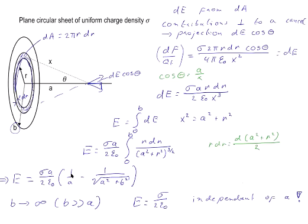
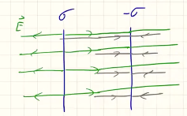

<!-- vscode-markdown-toc -->
* 1. [Week 3](#Week3)
	* 1.1. [Electric field distribution on surfaces](#Electricfielddistributiononsurfaces)

<!-- vscode-markdown-toc-config
	numbering=true
	autoSave=true
	/vscode-markdown-toc-config -->
<!-- /vscode-markdown-toc --># GENERAL PHYSICS 2

##  1. Week 3 

###  1.1. Electric field distribution on surfaces 

Granted that an electric field is simply 

$$E = \frac{F}{Q_{t}}$$

A single point charge will induce an electric field of size 

$$\vec E = \frac{Q}{4\pi\epsilon r^{2}}$$

Similarly, for a collection of point charges, the electric field becomes the vector sum of the single $E_{i}$

**The rod**
An recurent problem is the electric field from continous charge distribution on a rod of length $L$. This is given by:

$$ F = \frac{Q \lambda L}{4 \pi \epsilon_{0}x \sqrt{x^{2}+ (\frac{L}{2}^{2})}}$$

**Plane circular sheet**

$$E = \frac{\sigma}{2\epsilon_{0}}$$

Here is the derivation of the above:

Note that the given formula holds only when $b >> a$, that is we are significantly close to the plate which means that the most RHS term in the derivation will go to 0.

**Homogenous field around two plates**

Imagine we put two plates, of the same charge but opposite signs. Ie. something like this:

Now in between the fields, the total field is simply the sum of the two plates which is 

$$E_{\text{between}} = \frac{\sigma}{\epsilon_{0}}$$

And outside of the plates, if we observe the vector lines, the fields cancel each other out, resulting in $$E_{\text{outside}} = 0$$

**Electric potential**
Let's recall some definitions:

*E-field*: Force per test charge, vector field
*E-potential*: Potential energy per test charge, scalar field 

More formally, potential from point $A$ to $B$ is

$$V_{AB} = \frac{W_{AB}}{Q_{t}}$$

Where the $W_{AB}$ in the above is defined as:

$$W_{AB} = \int_{A}^{B} -\vec F \cdot d \vec L = \int_{A}^{B} -\vec Q_{t}\vec E \cdot d \vec L  \rightarrow V_{B} = \int_{A}^{B} -\vec E \cdot d \vec L  $$

An **important** point is that the potential is **independent** of path taken. 

Using the integral definition of $V_{p}$ we have that for a point charge

$$V_{P} = \int_{\infty}^{P} - \frac{Q\vec r \cdot d\vec L}{4 \pi \epsilon_{0}r^{2}}$$

Similarly, the potential of a collection of point charges is

$$V = \frac{1}{4 \pi \epsilon_{0}} \sum_{i} \frac{Q_{i}}{r_{i}}$$

**Electric potential around uniform charged disk**

Returning to the disk from earlier on, the expression for potential becomes 

$$ V = \frac{\sigma}{2 \pi \epsilon_{0}}(\sqrt{a^{2} + b^{2} -a})$$

Now we let $b$ go to infinity, well shouldnt the potential then go to infinity? The problem with this approach is that when $b$ goes to infinity, it will almost start touching our object which is a problem. 

